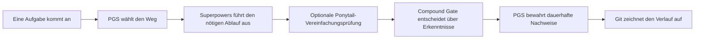
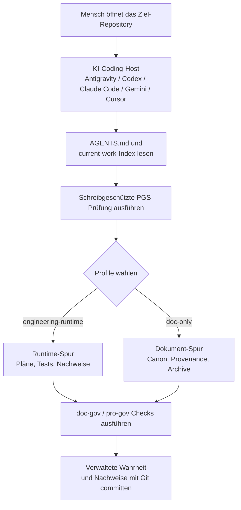

# Project Governance System

[](https://github.com/PieAIStudio/ProjectGovernanceSystem/actions/workflows/docs-check.yml)
[](https://www.npmjs.com/package/@pieai/pro-gov)
[](https://www.npmjs.com/package/@pieai/doc-gov)

[English](README.md) | [简体中文](README.zh-CN.md) | [日本語](README.ja-JP.md) | [Español](README.es.md) | [Français](README.fr.md) | **[Deutsch](README.de.md)**

<p align="center">
  
</p>

> Die englische Fassung ist die einzige maßgebliche Quelle. Bei Abweichungen
> gilt [README.md](README.md).

**Project Governance System (PGS) hält langfristige KI-unterstützte Projekte
verständlich, überprüfbar und leicht fortsetzbar.**

KI kann Pläne, Spezifikationen, Regeln, Berichte und Code sehr schnell erzeugen.
Ohne ein gemeinsames System werden die hilfreichen Dateien von gestern zu einem
Stapel widersprüchlicher Anweisungen. PGS gibt dauerhaftem KI-Arbeitsergebnis
einen klaren Ort, wählt für jede Aufgabe die passende Arbeitstiefe und prüft, ob
die Schutzmechanismen des Projekts wirklich verbunden sind.

PGS ist bewusst eine dünne Schicht. Es arbeitet neben Git, `AGENTS.md`,
[Superpowers](integrations/superpowers.md),
[Compound Engineering](integrations/compound-engineering.md) und dem optionalen
[Ponytail](integrations/ponytail.md), statt sie zu ersetzen.

## Warum PGS existiert

Stell dir vor, du öffnest ein KI-unterstütztes Projekt nach drei Wochen wieder.

Du findest vier Pläne, zwei „endgültige“ Spezifikationen, von verschiedenen
KI-Werkzeugen kopierte Regeln und einen Bericht, der vielleicht nicht mehr zum
aktuellen Code passt. Die KI kann alles lesen, aber nicht magisch erkennen,
welche Datei heute noch wahr ist.

PGS löst dieses Gedächtnis- und Ordnungsproblem:

- ein klarer Ort für die aktuelle verwaltete Wahrheit;
- ein Lebenszyklus für Entwürfe, aktive Arbeit, abgeschlossene Nachweise und
  ausgemustertes Material;
- ein Router für leichte oder technische Arbeitsabläufe;
- Prüfungen für defekte Links, alte Manifeste, fehlende Hooks und unvollständige CI;
- schreibgeschützte Projektinspektion vor Änderungen;
- explizite, überprüfbare Installationspläne für lokale Skills und Regeln.

Das Ziel ist nicht mehr Bürokratie, sondern weniger Zeit für die Frage:
„Welchem Dokument kann ich vertrauen?“

## Das 30-Sekunden-Modell

Stell dir das Projekt als belebtes Gebäude vor:

| System | Alltagsvergleich | Aufgabe |
| --- | --- | --- |
| Git | Sicherheitskamera und Verlaufsbuch | Zeichnet auf, was wann von wem geändert wurde. |
| `AGENTS.md` | Eingangsanweisung | Erklärt einer KI den Einstieg in dieses Projekt. |
| PGS | Bibliothek, Verkehrsleitzentrale und Prüfstelle | Ordnet dauerhafte Wahrheit, leitet Arbeit und prüft Schutzmechanismen. |
| Superpowers | Bauprozess | Liefert Brainstorming, Pläne, TDD, Debugging, Verifikation und Worktree-Disziplin. |
| Compound Engineering | Rezeptnotizbuch | Hält wiederverwendbare Erkenntnisse nach verifizierter Arbeit mit `ce-compound` fest. |
| Ponytail | Optionaler Kosten- und Komplexitätsberater | Hinterfragt unnötigen Code, ohne Anforderungen oder Nachweise zu streichen. |



PGS entscheidet, **wo Arbeit hingehört und welchen Weg sie braucht**.
Superpowers entscheidet, **wie disziplinierte Entwicklungsarbeit abläuft**.
Ponytail kann fragen, **ob die Umsetzung schlanker sein kann**. Compound
Engineering kann nach der Verifikation **wiederverwendbare Erkenntnisse**
festhalten. Git merkt sich die tatsächliche Änderung.

## Ein konkretes Beispiel

Maya baut mit zwei KI-Coding-Werkzeugen eine kleine App.

Vor PGS:

1. Eine KI erstellt `plan-final.md`.
2. Eine andere erstellt `new-plan-final-v2.md`.
3. Ein fertiger Plan bleibt im aktiven Ordner.
4. Eine neue Sitzung liest beide und wählt den falschen.
5. Das Team rekonstruiert mühsam den aktuellen Stand.

Nach PGS:

1. `AGENTS.md` führt die KI zum Router und zum Index der aktuellen Arbeit.
2. Aktive Spezifikation und Plan liegen an verwalteten Orten.
3. Der fertige Plan wechselt als Nachweis nach `docs/plans/completed/`.
4. `doc-gov` prüft Status, Links, erzeugtes Manifest, Hooks und CI.
5. Eine spätere Sitzung findet den aktuellen Weg, statt zu raten.

PGS trifft Mayas Produktentscheidungen nicht. Es macht das Projektgedächtnis
zuverlässig genug, damit Maya und ihre KI-Werkzeuge gemeinsam entscheiden können.

## Was du bekommst

### `@pieai/doc-gov`: die Prüfmaschine

`doc-gov` ist eine CLI, also ein Befehl, den Mensch, KI oder CI ausführen können.
Sie prüft:

- Metadaten, Lebenszyklus und kanonische Wahrheit von Dokumenten;
- Integrität von Router und Profile;
- Aktualität des erzeugten Manifests;
- lokale Markdown-Links;
- Git Hooks und GitHub Actions;
- Bereitschaft für schreibgeschützte Migration.

### `@pieai/pro-gov`: der Projektbaukasten

`pro-gov` verteilt und untersucht:

- Starter-Dateien für Governance;
- die Profile `engineering-runtime` und `doc-only`;
- schreibgeschützte init- und sync-Vergleiche;
- Projektsignale und Empfehlungen für Agent-Assets;
- lokale ProjectLens-Inspektionen und Berichte;
- überprüfbare Asset-Pläne aus einem vollständigen PGS-Checkout.

### Zwei Projekt-Profile

| Profile | Geeignet für |
| --- | --- |
| `engineering-runtime` | Apps, Spiele, Dienste, Browserprodukte und Projekte mit Laufzeitverhalten. |
| `doc-only` | Forschung, Schreiben, geistiges Eigentum, KI-Medien und asset-zentrierte Projekte. |

Profile ändern den Arbeitsweg, nicht die Produktwahrheit. App-Regeln,
Erzählkanon, Laufzeitkonfiguration, Prompts und Quell-Assets bleiben im
zuständigen Projekt.

### Optionale Portfolio-Steuerung

PGS kann mehrere Repositories über ein vom Nutzer gepflegtes Portfolio-Manifest
prüfen, aber das öffentliche Paket enthält keine echte Projektliste und keine
private Control Plane.

```json
{
  "schemaVersion": 1,
  "portfolioId": "example-org",
  "targets": [
    {
      "id": "web-app",
      "path": "/path/to/web-app",
      "profile": "engineering-runtime",
      "assetBundles": ["base-governance"]
    }
  ]
}
```

`pro-gov portfolio check|plan|assets-check|doctor` liest diese explizite Konfiguration. Wenn kein
vollständiger lokaler PGS-Checkout angegeben ist, nutzt es die geprüften public
assets, die mit `@pieai/pro-gov` ausgeliefert werden.
`portfolio doctor` ist eine offline und schreibgeschützte Flottenprüfung; es aktualisiert keine Plugins und ändert keine Ziel-Repositories.

## Wie die Teile zusammenarbeiten

1. Die KI liest `AGENTS.md`.
2. PGS wählt Profile und Weg aus `docs/governance/agents-routing/`.
3. Superpowers arbeitet in diesem Weg, wenn technische Disziplin nötig ist.
4. Ponytail wird ausdrücklich für eine begrenzte Vereinfachungsprüfung aufgerufen.
5. Dauerhafte Spezifikationen, Pläne, Entscheidungen und Referenzen landen an
   verwalteten Orten.
6. `doc-gov` und `pro-gov doctor` prüfen die echte Verbindung des Systems.

PGS verwendet **SSOT**, „Single Source of Truth“: Eine dauerhafte Tatsache soll
genau ein kanonisches Zuhause haben. Andere Dateien dürfen sie zusammenfassen
und verlinken, aber nicht mit ihr konkurrieren.

## PGS aus einem KI-Host verwenden

PGS ist dafür gedacht, über den KI-Coding-Host genutzt zu werden, in dem du
bereits arbeitest. Dieser Host kann Antigravity, Codex, Claude Code, Gemini CLI,
Cursor oder eine andere agentic-coding-Umgebung sein, die ein lokales Repository
öffnen und Projektdateien lesen kann.

Die Grundschleife ist einfach:

1. Öffne das **Zielprojekt** in deinem KI-Host.
2. Weise die KI an, zuerst `AGENTS.md` zu lesen. Wenn das Zielprojekt PGS noch
   nicht übernommen hat, lass es vor Dateiänderungen mit schreibgeschützten
   `pro-gov`-Befehlen prüfen.
3. Lass PGS das Profile wählen: `engineering-runtime` für Apps, Spiele, Dienste
   und Browserprodukte; `doc-only` für Forschung, Schreiben, Canon, KI-Medien
   und Asset-Governance.
4. Bitte die KI, das Zielprojekt in der gewählten Spur zu untersuchen, zu
   migrieren oder fortzuführen.
5. Nutze `doc-gov` und `pro-gov doctor`, um zu belegen, dass Links, Manifest,
   Hooks, Profiles und CI weiterhin den Regeln entsprechen.



Ein guter erster Prompt ist:

```text
Lies zuerst AGENTS.md. Prüfe dieses Projekt dann mit PGS im schreibgeschützten
Modus. Sag mir, welches Profile passt, wo die aktuelle Quelle der Wahrheit liegt,
was veraltet oder widersprüchlich wirkt und welche Validierungsbefehle vor
Dateiänderungen bestehen sollten.
```

Wenn du PGS auf ein anderes Projekt anwendest, kopiere keine privaten oder
mirrored Drittanbieter-Agent-Assets aus diesem Upstream-Repository. Nutze die
öffentlichen Pakete, Starter-Dateien und einen geprüften Migrationsplan, außer
du arbeitest aus einem vollständigen lokalen PGS-Checkout und wendest bewusst
verwaltete Agent-Assets an.

## Sicher ausprobieren

Du kannst PGS prüfen, ohne Überschreiben zu erlauben.

Node.js `24.x` ist erforderlich.

```bash
pnpm dlx @pieai/pro-gov assets list
pnpm dlx @pieai/pro-gov assets discover --target .
pnpm dlx @pieai/pro-gov assets recommend --target .
pnpm dlx @pieai/pro-gov lens inspect --target .
pnpm dlx @pieai/pro-gov init --profile engineering-runtime --dry-run
pnpm dlx @pieai/doc-gov migrate --profile engineering-runtime --check
```

Die Vorschau ist schreibgeschützt. Bei einem neuen Ziel bricht `init --apply`
vor dem Schreiben vollständig ab, sobald eine Zieldatei bereits existiert.
Bestehende Projekte nutzen den dry-run für eine bewusste Migration.

Zur Paketübernahme:

```bash
pnpm add -D @pieai/pro-gov @pieai/doc-gov
pnpm pro-gov init --profile engineering-runtime --dry-run
pnpm pro-gov init --profile engineering-runtime --apply
pnpm doc-gov scan
pnpm pro-gov sync --check --profile engineering-runtime
pnpm pro-gov doctor
pnpm doc-gov doctor
```

Lies vor der Migration vorhandener Dateien das
[Adoption Playbook](docs/reference/adoption/adoption-playbook.md).

## Ein Profile wählen

Nutze `engineering-runtime`, wenn Code oder Laufzeitverhalten Tests und
Ausführungsnachweise braucht.

Nutze `doc-only`, wenn die Hauptwahrheit Forschung, Schreiben, Kanon, Medien
oder Assets sind. Für echte Coding-Aufgaben kann es technische Werkzeuge nutzen,
ohne standardmäßig den vollständigen Prozess zu erben.

Im Zweifel beginne mit `doc-only` und ergänze den technischen Weg, sobald ein
echtes Laufzeitverhalten nachgewiesen werden muss.

## Empfohlene Begleitwerkzeuge

Superpowers wird für engineering/runtime-Projekte empfohlen. Es übernimmt
Brainstorming, Umsetzungspläne, TDD, Debugging, Verifikation und isolierte Worktrees.

Compound Engineering wird für Wissenssicherung nach der Arbeit empfohlen. In
PGS-gesteuerten Projekten konkurriert CE standardmäßig nicht mit Superpowers:
Es dient nach verifizierter Arbeit als Compound Gate und führt `ce-compound` nur
aus, wenn eine wiederverwendbare Erkenntnis festgehalten werden soll.

Ponytail ist als optionaler Berater nützlich. Lass den globalen Modus auf `off`;
teste `lite` zuerst in einer isolierten Aufgabe mit geringem Risiko. Ein kleinerer
Diff ist kein Gewinn, wenn Anforderungen, Tests, Sicherheit, Barrierefreiheit
oder Nachweise verloren gehen.

Siehe [Empfohlene Agent-Werkzeuge](docs/reference/adoption/recommended-agent-tooling.md).

## Was PGS nicht tut

PGS:

- ersetzt nicht Git, `AGENTS.md`, Superpowers, Compound Engineering oder Ponytail;
- versteht und überschreibt nicht automatisch jedes Projekt;
- verschiebt nicht jedes Markdown nach `docs/**`;
- verwaltet nicht automatisch generierte Medien, Produkt-Prompts,
  Laufzeitnotizen oder Paketdokumentation;
- veröffentlicht keine privaten oder fremden Skill-Inhalte im npm-Paket;
- verspricht keine feste Einsparung bei Code, Tokens, Zeit oder Kosten;
- installiert, aktiviert, aktualisiert oder löscht keine externen Plugins heimlich.

Das öffentliche Paket ist absichtlich konservativ. Schreibgeschützte Inspektion
kommt vor dem Schreiben, damit Governance nicht selbst Schaden verursacht.

## Repository-Karte

| Pfad | Zweck |
| --- | --- |
| `packages/doc-gov/` | Dokumentprüfung und Lebenszyklus-CLI. |
| `packages/pro-gov/` | Projektverteilung, Inspektion und schreibgeschützte Einführung. |
| `starter/` | Referenzdateien für ein verwaltetes Projekt. |
| `profiles/` | Wiederverwendbare Wege nach Projekttyp. |
| `docs/governance/` | Kernverträge für Dokumente und Routing. |
| `docs/policy/` | Eigene Entwicklungs- und Einführungsrichtlinien. |
| `docs/reference/adoption/` | Migrations-, Beziehungs-, Release- und Werkzeugleitfäden. |
| `integrations/` | Grenzen zu Superpowers, Compound Engineering, Ponytail und Directed Development. |
| `public-agent-assets/` | Öffentliche Oberfläche für geprüfte Skills, Regeln, Befehle und Bundles. |

Maintainer-Checkouts können einen lokalen `agent-assets/`-Baum enthalten. Er
wird von Git ignoriert; nur geprüfte öffentliche Inhalte gehören nach `public-agent-assets/`.

## Für Mitwirkende

KI-Agenten sollen bei `AGENTS.md` beginnen, nicht bei diesem README. Dieses
README ist die Einführung für Menschen.

Für einen lokalen Checkout:

```bash
pnpm install
pnpm typecheck
pnpm test
pnpm build
pnpm doc-gov doctor
pnpm pro-gov doctor
```

Änderungen an Lebenszyklus, Schema, Routing, Starter und wiederverwendbarer CLI
gehören zuerst in dieses Upstream-Repository. Produktspezifische Wahrheit bleibt
in Downstream-Projekten.

## Kurze FAQ

| Frage | Antwort |
| --- | --- |
| Ist das eine Projektmanagement-App? | Nein. Es ist eine dünne Governance- und Verteilungsschicht für dauerhafte KI-Arbeit. |
| Ersetzt es Git? | Nein. Git speichert Historie; PGS ordnet Wahrheit und prüft die Struktur. |
| Ist Superpowers Pflicht? | Nein, aber für engineering/runtime-Arbeit empfohlen. |
| Ersetzt es Compound Engineering? | Nein. CE kann den `ce-compound`-Lernabschluss liefern; vollständige CE-Flows bleiben explizit. |
| Soll Ponytail global aktiviert werden? | Nein. `off` beibehalten und `lite` zuerst isoliert testen. |
| Überschreibt `pro-gov init` mein Projekt? | Nein. `--apply` ist nur für neue Ziele gedacht und bricht vor dem Schreiben ab, wenn ein Ziel bereits existiert. |
| Können Freunde es nutzen? | Ja. Öffentlich sind `@pieai/pro-gov` und `@pieai/doc-gov`; private und fremde Skill-Inhalte fehlen. |

PGS wird dann wertvoll, wenn KI bereits schnell genug ist und das echte Problem
lautet: Ist das Projekt nach dem zehnten Plan, der fünften KI-Sitzung und für
die nächste Person noch verständlich?
