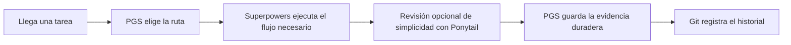
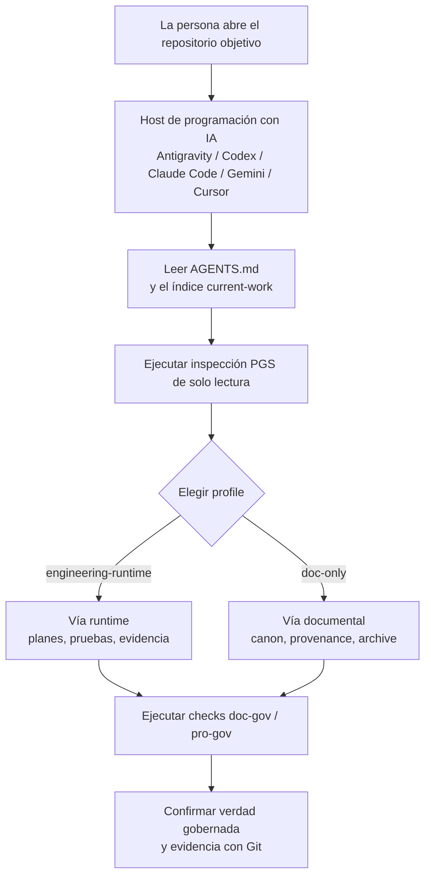

# Project Governance System

[](https://github.com/PieAIStudio/ProjectGovernanceSystem/actions/workflows/docs-check.yml)
[](https://www.npmjs.com/package/@pieai/pro-gov)
[](https://www.npmjs.com/package/@pieai/doc-gov)

[English](README.md) | [简体中文](README.zh-CN.md) | [日本語](README.ja-JP.md) | **[Español](README.es.md)** | [Français](README.fr.md) | [Deutsch](README.de.md)

<p align="center">
  
</p>

> La versión inglesa es la única fuente canónica. Si una traducción difiere,
> consulta [README.md](README.md).

**Project Governance System (PGS) mantiene comprensibles, verificables y fáciles
de continuar los proyectos de larga duración asistidos por IA.**

La IA puede crear planes, especificaciones, reglas, informes y código con gran
rapidez. Sin un sistema común, los archivos útiles de ayer se convierten en una
pila de instrucciones contradictorias. PGS da un lugar claro al trabajo
duradero creado por IA, elige la profundidad de trabajo adecuada y comprueba que
las protecciones del proyecto sigan conectadas.

Es una capa deliberadamente ligera. Colabora con Git, `AGENTS.md`,
[Superpowers](integrations/superpowers.md) y el
[Ponytail](integrations/ponytail.md) opcional, sin sustituirlos.

## Por qué existe PGS

Imagina volver a un proyecto asistido por IA después de tres semanas.

Encuentras cuatro planes, dos especificaciones «finales», varias reglas copiadas
por distintas herramientas y un informe que quizá ya no describa el código
actual. La IA puede leerlo todo, pero no puede saber por arte de magia qué
archivo sigue siendo verdad.

PGS resuelve ese problema de memoria y organización:

- un lugar claro para la verdad gobernada actual;
- un ciclo de vida para borradores, trabajo activo, pruebas terminadas y
  material retirado;
- un enrutador que elige un flujo ligero o de ingeniería;
- comprobaciones de enlaces rotos, manifests antiguos, hooks ausentes y CI
  incompleta;
- inspección de solo lectura antes de modificar;
- planes explícitos y revisables para instalar habilidades y reglas locales.

El objetivo no es crear más burocracia, sino preguntar menos veces: «¿Qué
documento debo creer?».

## El modelo en 30 segundos

Piensa en el proyecto como un edificio con mucha actividad:

| Sistema | Comparación cotidiana | Función |
| --- | --- | --- |
| Git | Cámara de seguridad y libro histórico | Registra qué cambió, cuándo y quién lo hizo. |
| `AGENTS.md` | Instrucciones de entrada | Explica a la IA cómo entrar en este proyecto. |
| PGS | Biblioteca, control de tráfico e inspección | Organiza la verdad duradera, dirige el trabajo y revisa las protecciones. |
| Superpowers | Proceso de construcción | Aporta lluvia de ideas, planes, TDD, depuración, verificación y disciplina de worktrees. |
| Ponytail | Asesor opcional de coste y complejidad | Cuestiona código y estructuras innecesarias sin cancelar requisitos ni pruebas. |



PGS decide **dónde vive el trabajo y qué ruta necesita**. Superpowers decide
**cómo avanza un trabajo de ingeniería disciplinado**. Ponytail puede preguntar
**si la implementación puede ser más ligera**. Git recuerda el cambio real.

## Un ejemplo concreto

Maya crea una pequeña aplicación con dos herramientas de programación con IA.

Antes de PGS:

1. Una IA escribe `plan-final.md`.
2. Otra crea `new-plan-final-v2.md`.
3. Un plan terminado sigue en la carpeta activa.
4. Una nueva sesión lee ambos y elige el equivocado.
5. El equipo reconstruye manualmente el estado actual.

Después de PGS:

1. `AGENTS.md` envía a la IA al enrutador y al índice de trabajo actual.
2. La especificación y el plan activos viven en lugares gobernados.
3. El plan terminado pasa a `docs/plans/completed/` como prueba histórica.
4. `doc-gov` revisa estado, enlaces, manifest generado, hooks y CI.
5. La siguiente sesión encuentra la ruta actual sin adivinar.

PGS no toma decisiones de producto por Maya. Hace que la memoria del proyecto
sea fiable para que Maya y sus herramientas decidan juntos el siguiente paso.

## Qué obtienes

### `@pieai/doc-gov`: la máquina de inspección

`doc-gov` es una CLI, es decir, un comando que puede ejecutar una persona, una
IA o CI. Comprueba:

- metadatos, ciclo de vida y verdad canónica de documentos;
- integridad del enrutador y del profile;
- vigencia del manifest generado;
- enlaces Markdown locales;
- hooks de Git y GitHub Actions;
- preparación para una migración de solo lectura.

### `@pieai/pro-gov`: el kit de preparación

`pro-gov` distribuye e inspecciona:

- archivos starter de gobernanza;
- profiles `engineering-runtime` y `doc-only`;
- comparaciones init y sync de solo lectura;
- señales del proyecto y recomendaciones de activos para agentes;
- inspecciones e informes al estilo ProjectLens;
- planes revisables de activos desde un checkout PGS completo.

### Dos profiles de proyecto

| Profile | Uso |
| --- | --- |
| `engineering-runtime` | Aplicaciones, juegos, servicios, productos web y proyectos con comportamiento en ejecución. |
| `doc-only` | Investigación, escritura, propiedad intelectual, medios de IA y proyectos centrados en activos. |

Los profiles cambian la ruta, no la verdad del producto. Las reglas de la
aplicación, el canon narrativo, la configuración, los prompts y los activos
fuente permanecen en su proyecto.

### Control portfolio opcional

PGS puede inspeccionar varios repositorios desde un portfolio manifest propiedad
del usuario, pero el paquete público no incluye listas reales de proyectos ni
un control plane privado.

```json
{
  "schemaVersion": 1,
  "portfolioId": "example-org",
  "targets": [
    {
      "id": "web-app",
      "path": "/path/to/web-app",
      "profile": "engineering-runtime",
      "assetBundles": ["base-governance"]
    }
  ]
}
```

`pro-gov portfolio check|plan` lee esa configuración explícita. Si no se indica
un checkout local completo de PGS, usa los public assets revisados que vienen
empaquetados con `@pieai/pro-gov`.

## Cómo colaboran las piezas

1. La IA lee `AGENTS.md`.
2. PGS selecciona profile y ruta desde `docs/governance/agents-routing/`.
3. Superpowers actúa dentro de esa ruta cuando hace falta disciplina de
   ingeniería.
4. Ponytail se invoca explícitamente para una revisión limitada de simplicidad.
5. Especificaciones, planes, decisiones y referencias duraderas van a lugares
   gobernados.
6. `doc-gov` y `pro-gov doctor` comprueban que el sistema esté conectado de
   verdad.

PGS usa **SSOT**, «fuente única de verdad»: un hecho duradero debe tener un único
hogar canónico. Otros archivos pueden resumirlo y enlazarlo, no competir con él.

## Usa PGS desde un host de IA

PGS está pensado para usarse desde el host de programación con IA donde ya
trabajas. Ese host puede ser Antigravity, Codex, Claude Code, Gemini CLI,
Cursor u otro entorno agentic coding capaz de abrir un repositorio local y leer
archivos del proyecto.

El ciclo básico es sencillo:

1. Abre el **proyecto objetivo** en tu host de IA.
2. Pide a la IA que lea primero `AGENTS.md`. Si el proyecto objetivo aún no ha
   adoptado PGS, pídele que lo inspeccione con comandos `pro-gov` de solo lectura
   antes de cambiar archivos.
3. Deja que PGS elija el profile: `engineering-runtime` para aplicaciones,
   juegos, servicios y productos de navegador; `doc-only` para investigación,
   escritura, canon, medios de IA y gobernanza de activos.
4. Pide a la IA que estudie, migre o continúe el proyecto dentro de la vía elegida.
5. Usa `doc-gov` y `pro-gov doctor` para demostrar que enlaces, manifest, hooks,
   profiles y CI siguen coincidiendo con las reglas.



Un buen primer prompt es:

```text
Lee primero AGENTS.md. Luego inspecciona este proyecto con PGS en modo de solo
lectura. Dime qué profile encaja, cuál es la fuente de verdad actual, qué parece
obsoleto o conflictivo y qué comandos de validación deberían pasar antes de editar archivos.
```

Al aplicar PGS a otro proyecto, no copies los agent assets privados o de terceros
reflejados desde este repositorio upstream. Usa los paquetes públicos, los
archivos starter y un plan de migración revisado, salvo que estés trabajando
desde un checkout local completo de PGS y aplicando intencionalmente agent assets
administrados.

## Pruébalo con seguridad

Puedes inspeccionar PGS sin permitir que sobrescriba el proyecto.

Requiere Node.js `24.x`.

```bash
pnpm dlx @pieai/pro-gov assets list
pnpm dlx @pieai/pro-gov assets discover --target .
pnpm dlx @pieai/pro-gov assets recommend --target .
pnpm dlx @pieai/pro-gov lens inspect --target .
pnpm dlx @pieai/pro-gov init --profile engineering-runtime --dry-run
pnpm dlx @pieai/doc-gov migrate --profile engineering-runtime --check
```

La vista previa es de solo lectura. En un destino nuevo, `init --apply` aborta
antes de escribir si ya existe cualquier archivo de destino. Los proyectos
existentes siguen una migración deliberada basada en el dry-run.

Para adoptar los paquetes:

```bash
pnpm add -D @pieai/pro-gov @pieai/doc-gov
pnpm pro-gov init --profile engineering-runtime --dry-run
pnpm pro-gov init --profile engineering-runtime --apply
pnpm doc-gov scan
pnpm pro-gov sync --check --profile engineering-runtime
pnpm pro-gov doctor
pnpm doc-gov doctor
```

Lee la [Guía de adopción](docs/reference/adoption/adoption-playbook.md) antes de
migrar archivos existentes.

## Elige un Profile

Usa `engineering-runtime` cuando haya código o comportamiento en ejecución que
necesite pruebas y evidencia.

Usa `doc-only` cuando la verdad principal sea investigación, escritura, canon,
medios o activos. Puede utilizar herramientas de ingeniería para una tarea real
de código, pero no hereda toda la ceremonia por defecto.

Si dudas, empieza con `doc-only` y añade la ruta de ingeniería cuando exista un
runtime real que demostrar.

## Herramientas complementarias recomendadas

Superpowers se recomienda para proyectos engineering/runtime. Gestiona lluvia
de ideas, planes, TDD, depuración, verificación y worktrees aislados.

Ponytail es útil como asesor opcional. Mantén su modo global en `off`; prueba
`lite` en una tarea aislada y de bajo riesgo antes de considerar `full`. Un diff
menor no es una victoria si pierde alcance, pruebas, seguridad, accesibilidad o
evidencia.

Consulta [Herramientas recomendadas para agentes](docs/reference/adoption/recommended-agent-tooling.md).

## Lo que PGS no hace

PGS no:

- sustituye Git, `AGENTS.md`, Superpowers o Ponytail;
- comprende y reescribe automáticamente todos los proyectos;
- mueve todo Markdown a `docs/**`;
- gobierna por defecto medios generados, prompts, notas de runtime o
  documentación de paquetes fuente;
- publica cuerpos de habilidades privadas o de terceros en npm;
- promete una reducción fija de código, tokens, tiempo o coste;
- instala, activa, actualiza o elimina plugins externos en silencio.

El paquete público es conservador a propósito. La inspección de solo lectura va
antes que la escritura para que la gobernanza no cause daños nuevos.

## Mapa del repositorio

| Ruta | Propósito |
| --- | --- |
| `packages/doc-gov/` | CLI de validación documental y ciclo de vida. |
| `packages/pro-gov/` | Distribución, inspección y adopción de solo lectura. |
| `starter/` | Archivos de referencia para un proyecto gobernado. |
| `profiles/` | Rutas reutilizables por tipo de proyecto. |
| `docs/governance/` | Contratos centrales de documentos y enrutamiento. |
| `docs/policy/` | Políticas propias de desarrollo y adopción. |
| `docs/reference/adoption/` | Guías de migración, relación, publicación y herramientas. |
| `integrations/` | Límites con Superpowers, Ponytail y Directed Development. |
| `public-agent-assets/` | Superficie pública para habilidades, reglas, comandos y bundles revisados. |

Los checkouts de mantenedor pueden tener un árbol local `agent-assets/`. Git lo
ignora; solo el contenido revisado para publicación debe promocionarse a `public-agent-assets/`.

## Para contribuir

Los agentes de IA deben empezar en `AGENTS.md`, no en este README. Este README es
la introducción para personas.

Para un checkout local:

```bash
pnpm install
pnpm typecheck
pnpm test
pnpm build
pnpm doc-gov doctor
pnpm pro-gov doctor
```

Los cambios centrales de ciclo de vida, schema, routing, starter y CLI
reutilizable entran primero en este repositorio. La verdad específica del
producto permanece en los proyectos posteriores.

## Preguntas rápidas

| Pregunta | Respuesta |
| --- | --- |
| ¿Es una aplicación de gestión de proyectos? | No. Es una capa ligera de gobernanza y distribución para trabajo duradero con IA. |
| ¿Sustituye Git? | No. Git registra el historial; PGS organiza la verdad y valida la estructura. |
| ¿Exige Superpowers? | No, pero se recomienda para flujos engineering/runtime. |
| ¿Debo activar Ponytail globalmente? | No. Mantén `off` y prueba `lite` primero en una tarea aislada. |
| ¿`pro-gov init` sobrescribe el proyecto? | No. `--apply` solo sirve para destinos nuevos y aborta antes de escribir si ya existe cualquier destino. |
| ¿Pueden usarlo mis amigos? | Sí. Los paquetes públicos son `@pieai/pro-gov` y `@pieai/doc-gov`; no incluyen habilidades privadas ni de terceros. |

PGS resulta útil cuando la IA ya es suficientemente rápida y el verdadero
problema es que el proyecto siga siendo comprensible después del décimo plan,
la quinta sesión de IA y la siguiente persona que deba continuar.
