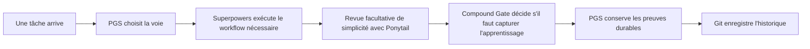
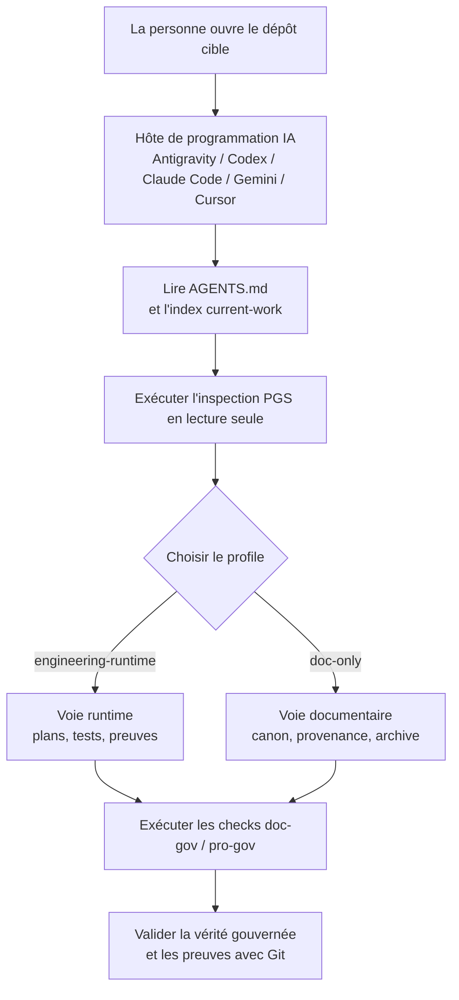

# Project Governance System

[](https://github.com/PieAIStudio/ProjectGovernanceSystem/actions/workflows/docs-check.yml)
[](https://www.npmjs.com/package/@pieai/pro-gov)
[](https://www.npmjs.com/package/@pieai/doc-gov)

[English](README.md) | [简体中文](README.zh-CN.md) | [日本語](README.ja-JP.md) | [Español](README.es.md) | **[Français](README.fr.md)** | [Deutsch](README.de.md)

<p align="center">
  
</p>

> La version anglaise est l'unique source canonique. En cas d'écart, consultez
> [README.md](README.md).

**Project Governance System (PGS) garde les projets de longue durée assistés par
l'IA compréhensibles, vérifiables et faciles à reprendre.**

L'IA peut produire très vite des plans, spécifications, règles, rapports et du
code. Sans système commun, les fichiers utiles d'hier deviennent une pile
d'instructions contradictoires. PGS donne une place claire au travail durable
créé par l'IA, choisit la profondeur de workflow adaptée et vérifie que les
garde-fous du projet sont réellement connectés.

C'est volontairement une couche légère. Elle travaille avec Git, `AGENTS.md`,
[Superpowers](integrations/superpowers.md),
[Compound Engineering](integrations/compound-engineering.md) et
[Ponytail](integrations/ponytail.md), facultatif, sans les remplacer.

## Pourquoi PGS existe

Imaginez rouvrir un projet assisté par IA après trois semaines.

Vous trouvez quatre plans, deux spécifications « finales », plusieurs règles
copiées par des outils différents et un rapport qui ne décrit peut-être plus le
code actuel. L'IA peut tout lire, mais elle ne peut pas deviner quel fichier
représente encore la vérité.

PGS résout ce problème de mémoire et d'organisation :

- un emplacement clair pour la vérité gouvernée actuelle ;
- un cycle de vie pour brouillons, travail actif, preuves terminées et archives ;
- un routeur qui choisit un workflow léger ou d'ingénierie ;
- des contrôles pour les liens cassés, manifests périmés, hooks absents et CI
  incomplète ;
- une inspection en lecture seule avant toute modification ;
- des plans explicites et révisables pour les compétences et règles locales.

Le but n'est pas d'ajouter de la bureaucratie, mais de moins demander :
« Quel document dois-je croire ? »

## Le modèle en 30 secondes

Imaginez le projet comme un bâtiment très actif :

| Système | Comparaison quotidienne | Rôle |
| --- | --- | --- |
| Git | Caméra de sécurité et registre historique | Enregistre quoi, quand et par qui. |
| `AGENTS.md` | Consignes à l'entrée | Explique à l'IA comment entrer dans ce projet. |
| PGS | Bibliothécaire, circulation et inspection | Organise la vérité durable, dirige le travail et vérifie les garde-fous. |
| Superpowers | Processus de construction | Fournit brainstorming, plans, TDD, débogage, vérification et discipline worktree. |
| Compound Engineering | Carnet de recettes | Capture les apprentissages réutilisables avec `ce-compound` après le travail vérifié. |
| Ponytail | Conseiller facultatif en coût et complexité | Questionne le code inutile sans supprimer exigences ni preuves. |



PGS décide **où le travail appartient et quelle voie il nécessite**.
Superpowers décide **comment l'ingénierie disciplinée avance**. Ponytail peut
demander **si l'implémentation peut être plus légère**. Compound Engineering peut
conserver **les apprentissages réutilisables** après vérification. Git mémorise
le changement.

## Un exemple concret

Maya construit une petite application avec deux outils de programmation IA.

Avant PGS :

1. Une IA crée `plan-final.md`.
2. Une autre crée `new-plan-final-v2.md`.
3. Un plan terminé reste dans le dossier actif.
4. Une nouvelle session lit les deux et choisit le mauvais.
5. L'équipe doit reconstruire l'état actuel.

Après PGS :

1. `AGENTS.md` dirige l'IA vers le routeur et l'index du travail courant.
2. La spécification et le plan actifs vivent dans des emplacements gouvernés.
3. Le plan terminé va dans `docs/plans/completed/` comme preuve historique.
4. `doc-gov` vérifie statut, liens, manifest généré, hooks et CI.
5. La session suivante trouve la voie actuelle sans deviner.

PGS ne décide pas du produit à la place de Maya. Il rend la mémoire du projet
assez fiable pour que Maya et ses outils décident ensemble de la suite.

## Ce que vous obtenez

### `@pieai/doc-gov` : la machine d'inspection

`doc-gov` est une CLI, c'est-à-dire une commande exécutable par une personne,
une IA ou la CI. Elle vérifie :

- métadonnées, cycle de vie et vérité canonique ;
- intégrité du routeur et du profile ;
- fraîcheur du manifest généré ;
- liens Markdown locaux ;
- hooks Git et GitHub Actions ;
- préparation à une migration en lecture seule.

### `@pieai/pro-gov` : le kit de préparation

`pro-gov` distribue et inspecte :

- fichiers starter de gouvernance ;
- profiles `engineering-runtime` et `doc-only` ;
- comparaisons init et sync en lecture seule ;
- signaux du projet et recommandations d'actifs pour agents ;
- inspections et rapports de style ProjectLens ;
- plans révisables d'actifs depuis un checkout PGS complet.

### Deux profiles de projet

| Profile | Utilisation |
| --- | --- |
| `engineering-runtime` | Applications, jeux, services, produits web et projets avec comportement d'exécution. |
| `doc-only` | Recherche, écriture, propriété intellectuelle, médias IA et projets centrés sur les actifs. |

Les profiles changent la voie, pas la vérité du produit. Règles de l'application,
canon narratif, configuration, prompts et actifs source restent dans leur projet.

### Contrôle portfolio optionnel

PGS peut inspecter plusieurs dépôts depuis un portfolio manifest appartenant à
l'utilisateur, mais le paquet public n'embarque aucune liste réelle de projets
ni control plane privé.

```json
{
  "schemaVersion": 1,
  "portfolioId": "example-org",
  "targets": [
    {
      "id": "web-app",
      "path": "/path/to/web-app",
      "profile": "engineering-runtime",
      "assetBundles": ["base-governance"]
    }
  ]
}
```

`pro-gov portfolio check|plan|assets-check|doctor` lit cette configuration explicite. Si aucun
checkout local complet de PGS n'est fourni, il utilise les public assets revus
embarqués avec `@pieai/pro-gov`.
`portfolio doctor` est un contrôle de parc hors ligne et en lecture seule ; il ne met pas à jour les plugins et ne modifie aucun dépôt cible.

## Comment les éléments coopèrent

1. L'IA lit `AGENTS.md`.
2. PGS choisit profile et voie dans `docs/governance/agents-routing/`.
3. Superpowers agit dans cette voie si une discipline d'ingénierie est nécessaire.
4. Ponytail est invoqué explicitement pour une revue limitée de simplicité.
5. Spécifications, plans, décisions et références durables vont aux bons endroits.
6. `doc-gov` et `pro-gov doctor` vérifient le câblage réel du système.

PGS applique le **SSOT**, ou « source unique de vérité » : un fait durable doit
avoir un seul domicile canonique. Les autres fichiers résument et pointent vers lui.

## Utiliser PGS depuis un hôte IA

PGS est conçu pour être utilisé depuis l'hôte de programmation IA dans lequel
vous travaillez déjà. Cet hôte peut être Antigravity, Codex, Claude Code, Gemini
CLI, Cursor ou un autre environnement agentic coding capable d'ouvrir un dépôt
local et de lire les fichiers du projet.

La boucle de base est simple :

1. Ouvrez le **projet cible** dans votre hôte IA.
2. Demandez à l'IA de lire `AGENTS.md` en premier. Si le projet cible n'a pas
   encore adopté PGS, demandez une inspection avec les commandes `pro-gov` en
   lecture seule avant de modifier des fichiers.
3. Laissez PGS choisir le profile : `engineering-runtime` pour applications,
   jeux, services et produits navigateur ; `doc-only` pour recherche, écriture,
   canon, médias IA et gouvernance d'actifs.
4. Demandez à l'IA d'étudier, migrer ou continuer le projet dans la voie choisie.
5. Utilisez `doc-gov` et `pro-gov doctor` pour prouver que liens, manifest,
   hooks, profiles et CI correspondent toujours aux règles.



Un bon premier prompt :

```text
Lisez d'abord AGENTS.md. Inspectez ensuite ce projet avec PGS en mode lecture
seule. Dites-moi quel profile convient, où se trouve la source actuelle de vérité,
ce qui semble obsolète ou conflictuel, et quelles commandes de validation doivent
passer avant toute modification de fichiers.
```

Lorsque vous appliquez PGS à un autre projet, ne copiez pas les agent assets
privés ou tiers miroirs de ce dépôt upstream. Utilisez les paquets publics, les
fichiers starter et un plan de migration relu, sauf si vous travaillez depuis un
checkout local complet de PGS et appliquez volontairement des agent assets gérés.

## Essayez sans risque

Vous pouvez inspecter PGS sans l'autoriser à écraser le projet.

Node.js `24.x` est requis.

```bash
pnpm dlx @pieai/pro-gov assets list
pnpm dlx @pieai/pro-gov assets discover --target .
pnpm dlx @pieai/pro-gov assets recommend --target .
pnpm dlx @pieai/pro-gov lens inspect --target .
pnpm dlx @pieai/pro-gov init --profile engineering-runtime --dry-run
pnpm dlx @pieai/doc-gov migrate --profile engineering-runtime --check
```

L'aperçu est en lecture seule. Sur une cible neuve, `init --apply` s'arrête avant
toute écriture si un fichier de destination existe déjà. Les projets existants
suivent une migration explicite à partir du dry-run.

Pour adopter les paquets :

```bash
pnpm add -D @pieai/pro-gov @pieai/doc-gov
pnpm pro-gov init --profile engineering-runtime --dry-run
pnpm pro-gov init --profile engineering-runtime --apply
pnpm doc-gov scan
pnpm pro-gov sync --check --profile engineering-runtime
pnpm pro-gov doctor
pnpm doc-gov doctor
```

Lisez le [guide d'adoption](docs/reference/adoption/adoption-playbook.md) avant
de migrer des fichiers existants.

## Choisir un Profile

Utilisez `engineering-runtime` lorsque du code ou un runtime exige tests et preuves.

Utilisez `doc-only` lorsque la vérité principale est recherche, écriture, canon,
média ou actifs. Un projet doc-only peut employer des outils d'ingénierie pour
une vraie tâche de code sans recevoir toute la cérémonie par défaut.

En cas de doute, commencez par `doc-only`, puis ajoutez la voie d'ingénierie
lorsqu'un runtime réel doit être prouvé.

## Outils complémentaires recommandés

Superpowers est recommandé pour les projets engineering/runtime. Il gère
brainstorming, plans, TDD, débogage, vérification et worktrees isolés.

Compound Engineering est recommandé pour capturer la connaissance après le
travail. Dans les projets gouvernés par PGS, CE ne concurrence pas Superpowers
par défaut : il sert de Compound Gate après le travail vérifié et lance
`ce-compound` seulement lorsqu'un apprentissage réutilisable mérite d'être gardé.

Ponytail est utile comme conseiller facultatif. Gardez son mode global sur
`off` ; testez `lite` dans une tâche isolée et peu risquée avant `full`. Un diff
plus petit n'est pas un progrès s'il perd périmètre, tests, sécurité,
accessibilité ou preuves.

Voir [Outils recommandés pour agents](docs/reference/adoption/recommended-agent-tooling.md).

## Ce que PGS ne fait pas

PGS ne :

- remplace pas Git, `AGENTS.md`, Superpowers, Compound Engineering ou Ponytail ;
- comprend et réécrit automatiquement tous les projets ;
- déplace pas tout Markdown dans `docs/**` ;
- gouverne pas par défaut médias générés, prompts, notes runtime ou documentation source ;
- publie pas les corps de compétences privées ou tierces sur npm ;
- promet pas un pourcentage fixe de réduction du code, des tokens, du temps ou du coût ;
- installe, active, met à jour ou supprime silencieusement des plugins externes.

Le paquet public est volontairement prudent. L'inspection en lecture seule
précède l'écriture pour que l'outil de gouvernance ne devienne pas une nouvelle
source de dégâts.

## Carte du dépôt

| Chemin | Rôle |
| --- | --- |
| `packages/doc-gov/` | CLI de validation documentaire et cycle de vie. |
| `packages/pro-gov/` | Distribution, inspection et adoption en lecture seule. |
| `starter/` | Fichiers de référence pour un projet gouverné. |
| `profiles/` | Voies réutilisables par type de projet. |
| `docs/governance/` | Contrats centraux de documents et routage. |
| `docs/policy/` | Politiques de développement et d'adoption de PGS. |
| `docs/reference/adoption/` | Guides de migration, relation, publication et outils. |
| `integrations/` | Frontières avec Superpowers, Compound Engineering, Ponytail et Directed Development. |
| `public-agent-assets/` | Surface publique pour les compétences, règles, commandes et bundles revus. |

Les checkouts de mainteneur peuvent avoir un arbre local `agent-assets/`. Ce dossier
est ignoré par Git ; seul le contenu revu pour publication doit être promu dans `public-agent-assets/`.

## Pour contribuer

Les agents IA doivent commencer par `AGENTS.md`, pas par ce README. Celui-ci est
l'introduction destinée aux personnes.

Pour un checkout local :

```bash
pnpm install
pnpm typecheck
pnpm test
pnpm build
pnpm doc-gov doctor
pnpm pro-gov doctor
```

Les changements centraux de cycle de vie, schema, routage, starter et CLI
réutilisable arrivent d'abord ici. La vérité spécifique au produit reste en aval.

## FAQ rapide

| Question | Réponse |
| --- | --- |
| Est-ce une application de gestion de projet ? | Non. C'est une couche légère de gouvernance et distribution du travail IA durable. |
| Remplace-t-elle Git ? | Non. Git enregistre l'historique ; PGS organise la vérité et valide la structure. |
| Superpowers est-il obligatoire ? | Non, mais il est recommandé pour engineering/runtime. |
| Remplace-t-elle Compound Engineering ? | Non. CE peut fournir la queue d'apprentissage `ce-compound` ; les flux CE complets restent explicites. |
| Faut-il activer Ponytail globalement ? | Non. Gardez `off` et testez d'abord `lite` dans une tâche isolée. |
| `pro-gov init` écrase-t-il le projet ? | Non. `--apply` est réservé aux cibles neuves et s'arrête avant toute écriture si une destination existe. |
| Mes amis peuvent-ils l'utiliser ? | Oui. Les paquets publics sont `@pieai/pro-gov` et `@pieai/doc-gov`, sans compétences privées ou tierces. |

PGS devient utile lorsque l'IA est déjà assez rapide et que le vrai problème est
de garder le projet compréhensible après le dixième plan, la cinquième session
d'IA et la prochaine personne qui doit reprendre le travail.
