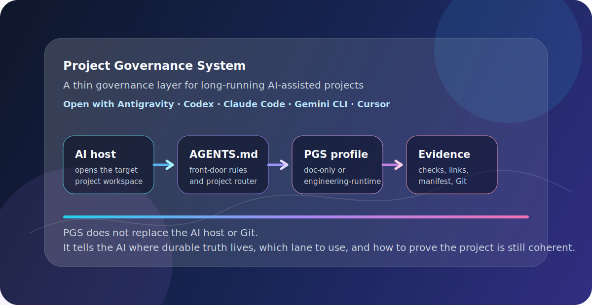
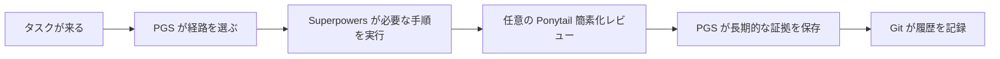
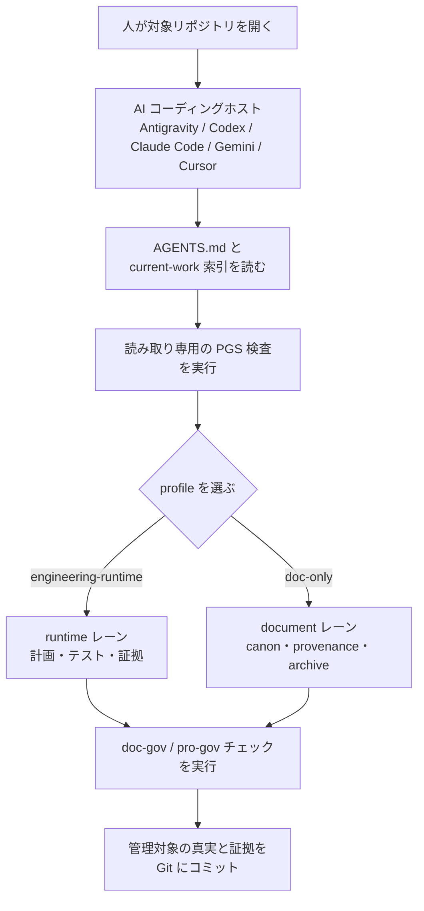

# Project Governance System

[](https://github.com/PieAIStudio/ProjectGovernanceSystem/actions/workflows/docs-check.yml)
[](https://www.npmjs.com/package/@pieai/pro-gov)
[](https://www.npmjs.com/package/@pieai/doc-gov)

[English](README.md) | [简体中文](README.zh-CN.md) | **[日本語](README.ja-JP.md)** | [Español](README.es.md) | [Français](README.fr.md) | [Deutsch](README.de.md)

<p align="center">
  
</p>

> 英語版が唯一の原文です。翻訳との間に差異がある場合は
> [README.md](README.md) を基準にしてください。

**Project Governance System（PGS）は、長期間にわたる AI 支援プロジェクトを、
理解しやすく、検証しやすく、再開しやすい状態に保ちます。**

AI は計画、仕様、ルール、レポート、コードを高速に作れます。しかし共通の管理方法が
なければ、昨日は役立ったファイルが、明日には矛盾した指示の山になります。PGS は
長く残す AI 成果物に明確な置き場所を与え、タスクごとに適切な作業の深さを選び、
プロジェクトの安全装置が本当に接続されているか確認します。

PGS は意図的に薄い層です。Git、`AGENTS.md`、
[Superpowers](integrations/superpowers.md)、任意の
[Ponytail](integrations/ponytail.md) と協力し、それらを置き換えません。

## PGS が必要な理由

3週間ぶりに AI 支援プロジェクトを開く場面を想像してください。

計画が4つ、「最終版」の仕様が2つ、複数の AI ツールがコピーしたルール、そして現在の
コードを説明しているか分からないレポートがあります。AI は全部読めても、どれが今の
真実かを魔法のように判断することはできません。

PGS はこの「プロジェクトの記憶と整理」の問題を解決します。

- 現在の管理対象の真実を置く場所を一つにする。
- 下書き、進行中、完了した証拠、引退した資料にライフサイクルを与える。
- 軽量な作業かエンジニアリング作業かをルーターが選ぶ。
- 壊れたリンク、古い manifest、未設定の hooks、不完全な CI を検出する。
- 変更前に読み取り専用でプロジェクトを調べる。
- ローカルのスキルやルールを、レビュー可能な計画から導入する。

目的は書類を増やすことではありません。「どの文書を信じればよいか」を調べる時間を
減らすことです。

## 30秒で分かる仕組み

プロジェクトを忙しい建物として考えてください。

| システム | 日常のたとえ | 役割 |
| --- | --- | --- |
| Git | 防犯カメラと履歴台帳 | 誰が、いつ、何を変えたか記録する。 |
| `AGENTS.md` | 入口の案内 | AI にこのプロジェクトへの入り方を教える。 |
| PGS | 司書、交通整理、検査所 | 長期的な真実を整理し、作業を振り分け、安全装置を確認する。 |
| Superpowers | 工事手順 | ブレインストーミング、計画、TDD、デバッグ、検証、worktree の規律を担う。 |
| Ponytail | 任意のコスト・複雑度アドバイザー | 不要なコードや構造を疑うが、要件や証明は削らない。 |



PGS は**作業の置き場所と経路**を決めます。Superpowers は**規律ある実装手順**を
担当します。Ponytail は**もっと簡潔にできるか**を問い、Git は実際の変更を記録します。

## 具体的な例

マヤは2つの AI コーディングツールで小さなアプリを作っています。

PGS 導入前：

1. ある AI が `plan-final.md` を作る。
2. 別の AI が `new-plan-final-v2.md` を作る。
3. 完了した計画が進行中フォルダーに残る。
4. 新しいセッションが両方を読み、古い方を選ぶ。
5. チームは現状の再調査に時間を使う。

PGS 導入後：

1. `AGENTS.md` が AI をプロジェクトルーターと current-work 索引へ案内する。
2. 現在の仕様と計画が管理された場所に入る。
3. 完了した計画は証拠として `docs/plans/completed/` に移る。
4. `doc-gov` が文書状態、リンク、生成 manifest、hooks、CI 配線を確認する。
5. 次の AI セッションは推測せず、現在の経路を見つけられる。

PGS はマヤの代わりに製品判断をしません。マヤと AI が次の判断を行えるよう、
プロジェクトの記憶を信頼できる状態にします。

## 得られるもの

### `@pieai/doc-gov`：検査機

`doc-gov` は CLI、つまり人、AI、CI が実行できるコマンドです。次を確認します。

- 文書のメタデータ、ライフサイクル、正規の真実。
- ルーターと profile の整合性。
- 生成 manifest の鮮度。
- ローカル Markdown リンク。
- Git hooks と GitHub Actions の配線。
- 読み取り専用の移行準備状況。

### `@pieai/pro-gov`：プロジェクト設定キット

`pro-gov` は次を配布・検査します。

- starter ガバナンスファイル。
- `engineering-runtime` と `doc-only` profile。
- 読み取り専用の init と sync 比較。
- プロジェクト信号の検出と agent 資産の推薦。
- ProjectLens 形式のローカル検査とレポート。
- 完全な PGS checkout で使う、レビュー可能な agent 資産計画。

### 2つのプロジェクト profile

| Profile | 対象 |
| --- | --- |
| `engineering-runtime` | アプリ、ゲーム、サービス、ブラウザ製品など実行時動作のあるプロジェクト。 |
| `doc-only` | 調査、執筆、知的財産、AI メディア、資産中心のプロジェクト。 |

Profile が変えるのは作業経路であり、製品の真実ではありません。アプリのルール、
物語設定、実行設定、プロンプト、原始資産は、それを所有するプロジェクトに残ります。

## 各要素の連携

1. AI が `AGENTS.md` を読む。
2. PGS が `docs/governance/agents-routing/` から profile とレーンを選ぶ。
3. エンジニアリング規律が必要なら Superpowers がそのレーン内で動く。
4. 限定された簡素化レビューが必要なときだけ Ponytail を明示的に呼ぶ。
5. 長期保存する仕様、計画、決定、参考資料を管理された場所に置く。
6. `doc-gov` と `pro-gov doctor` が、説明だけでなく実際の配線を確認する。

PGS は **SSOT**、つまり「単一の真実の源」を使います。長期的な事実には正規の住所を
一つだけ持たせ、他のファイルは要約とリンクに留めます。

## AI ホストから PGS を使う

PGS は単独で開くプロジェクト管理アプリではありません。すでに使っている AI コーディング
ホストから使うための仕組みです。ホストは Antigravity、Codex、Claude Code、Gemini
CLI、Cursor、またはローカルリポジトリを開いてファイルを読める agentic coding 環境です。

基本の流れはシンプルです。

1. AI ホストで**対象プロジェクト**を開く。
2. AI にまず `AGENTS.md` を読むよう指示する。対象プロジェクトがまだ PGS を採用して
   いない場合は、ファイル変更の前に読み取り専用の `pro-gov` コマンドで検査する。
3. PGS に profile を選ばせる。アプリ、ゲーム、サービス、ブラウザ製品は
   `engineering-runtime`、調査、執筆、canon、AI メディア、資産ガバナンスは
   `doc-only`。
4. 選ばれたレーンの中で、AI に対象プロジェクトを調査、移行、または継続させる。
5. `doc-gov` と `pro-gov doctor` で、リンク、manifest、hooks、profiles、CI 配線が
   ルールと一致していることを証明する。



最初のプロンプト例：

```text
まず AGENTS.md を読んでください。次に PGS を読み取り専用モードで使い、この
プロジェクトを検査してください。どの profile が合うか、現在の真実の源はどこか、
古いまたは衝突しているものは何か、編集前に通すべき検証コマンドは何かを教えてください。
```

PGS を別プロジェクトに適用するとき、この上流リポジトリの private または mirror された
第三者 agent assets をコピーしないでください。完全なローカル PGS checkout から意図的に
managed agent assets を適用する場合を除き、公開パッケージ、starter ファイル、レビュー済み
移行計画を使います。

## 安全に試す

PGS に上書きを許可せず、まず検査できます。

Node.js `22.12.0` 以降が必要です。

```bash
pnpm dlx @pieai/pro-gov assets list
pnpm dlx @pieai/pro-gov assets discover --target .
pnpm dlx @pieai/pro-gov assets recommend --target .
pnpm dlx @pieai/pro-gov lens inspect --target .
pnpm dlx @pieai/pro-gov init --profile engineering-runtime --dry-run
pnpm dlx @pieai/doc-gov migrate --profile engineering-runtime --check
```

現在の init と sync は読み取り専用です。存在、不足、差分を表示し、別プロジェクトの
ルーターを勝手に書き換えません。

プロジェクトへ導入する場合：

```bash
pnpm add -D @pieai/pro-gov @pieai/doc-gov
pnpm pro-gov doctor
pnpm doc-gov check
```

既存ファイルを移行する前に
[導入プレイブック](docs/reference/adoption/adoption-playbook.md) を読んでください。

## Profile の選び方

コードや実行時動作があり、テストと実行証拠が必要なら `engineering-runtime` を使います。

主な真実が調査、執筆、設定、メディア、資産なら `doc-only` を使います。Doc-only
でも実際のコーディング作業にはエンジニアリングツールを使えますが、既定で全工程を
背負いません。

迷ったら `doc-only` から始め、証明すべき実行時動作ができた時点で経路を追加します。

## 推奨する連携ツール

Superpowers は engineering/runtime プロジェクトに推奨されます。ブレインストーミング、
実装計画、TDD、デバッグ、完了前検証、隔離 worktree を担当します。

Ponytail はインストール済みの任意アドバイザーとして有用です。グローバルモードは
`off` にし、まず低リスクの隔離タスクで `lite` を試します。小さい差分でも、要件、
テスト、安全性、アクセシビリティ、証拠を失えば成功ではありません。

詳細は [推奨 Agent ツール](docs/reference/adoption/recommended-agent-tooling.md)
を参照してください。

## PGS がしないこと

PGS は次を行いません。

- Git、`AGENTS.md`、Superpowers、Ponytail の置き換え。
- すべてのプロジェクトの自動理解と書き換え。
- すべての Markdown を `docs/**` へ移動。
- 生成メディア、製品プロンプト、実行メモ、ソースパッケージ文書を自動的に管理。
- 公開 npm パッケージへの非公開・第三者スキル本文の収録。
- コード、token、時間、費用の固定削減率の保証。
- 外部 AI プラグインの無断インストール、有効化、更新、削除。

公開パッケージが保守的なのは意図的です。書き込み前に読み取り専用検査を行うことで、
ガバナンスツール自身が新しい損害源になるのを防ぎます。

## リポジトリ構成

| パス | 用途 |
| --- | --- |
| `packages/doc-gov/` | 文書検証 CLI とライフサイクル検査。 |
| `packages/pro-gov/` | プロジェクト配布、検査、読み取り専用導入 CLI。 |
| `starter/` | 管理されたプロジェクトの参考ファイル。 |
| `profiles/` | 再利用可能なプロジェクト種別ルート。 |
| `docs/governance/` | 中核文書とルーティング契約。 |
| `docs/policy/` | PGS 自身の開発・導入方針。 |
| `docs/reference/adoption/` | 移行、関係、公開、ツールのガイド。 |
| `integrations/` | Superpowers、Ponytail、Directed Development との境界。 |
| `public-agent-assets/` | 公開レビュー済みのスキル、ルール、コマンド、bundle の公開面。 |

メンテナーの checkout にはローカル専用の `agent-assets/` ツリーが存在する場合があります。
これは Git で無視され、明示的な公開レビュー後にのみ `public-agent-assets/` へ昇格します。

## コントリビューター向け

AI はこの README ではなく `AGENTS.md` から開始します。この README は人向けです。

ローカル checkout：

```bash
pnpm install
pnpm typecheck
pnpm test
pnpm build
pnpm doc-gov doctor
pnpm pro-gov doctor
```

中核ライフサイクル、schema、ルーティング、starter、再利用 CLI の変更は、まずこの
上流リポジトリに入れます。製品固有の真実は下流プロジェクトに残します。

## よくある質問

| 質問 | 回答 |
| --- | --- |
| プロジェクト管理アプリですか？ | いいえ。長期 AI 作業のための薄いガバナンス・配布層です。 |
| Git を置き換えますか？ | いいえ。Git は履歴、PGS は真実の整理と協業構造の検査を担当します。 |
| Superpowers は必須ですか？ | 必須ではありませんが、engineering/runtime 作業には推奨です。 |
| Ponytail をグローバルで有効にすべきですか？ | いいえ。`off` を保ち、隔離タスクで `lite` を先に試します。 |
| `pro-gov init` は上書きしますか？ | 現行版ではしません。対応する init は読み取り専用の `--dry-run` です。 |
| 友人も使えますか？ | はい。公開パッケージは `@pieai/pro-gov` と `@pieai/doc-gov` で、非公開・第三者スキル本文は含みません。 |

AI が十分速くなり、本当の問題が「10個目の計画、5回目の AI セッション、次の担当者が
まだプロジェクトを理解できるか」に変わったとき、PGS が役立ちます。
