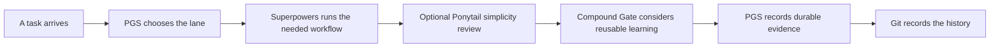
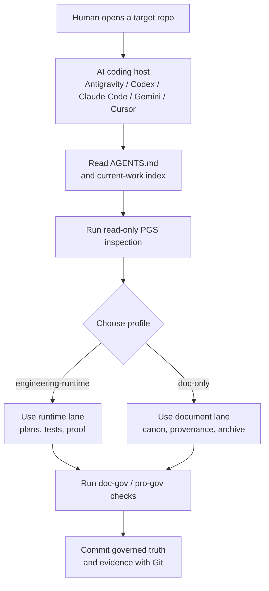

# Project Governance System

[](https://github.com/PieAIStudio/ProjectGovernanceSystem/actions/workflows/docs-check.yml)
[](https://www.npmjs.com/package/@pieai/pro-gov)
[](https://www.npmjs.com/package/@pieai/doc-gov)

**[English](README.md)** | [简体中文](README.zh-CN.md) | [日本語](README.ja-JP.md) | [Español](README.es.md) | [Français](README.fr.md) | [Deutsch](README.de.md)

<p align="center">
  
</p>

**Project Governance System (PGS) keeps long-running AI-assisted projects
understandable, verifiable, and easier to continue.**

AI can create plans, specifications, rules, reports, and code very quickly.
Without a shared system, yesterday's helpful files become tomorrow's pile of
conflicting instructions. PGS gives durable AI-created work a clear home,
chooses the right workflow depth for each task, and checks that the project's
guardrails are still connected.

It is deliberately a thin layer. It works beside Git, `AGENTS.md`,
[Superpowers](integrations/superpowers.md),
[Compound Engineering](integrations/compound-engineering.md), and optional
[Ponytail](integrations/ponytail.md) rather than trying to replace them.

## Why PGS Exists

Imagine returning to an AI-assisted project after three weeks.

You find four plans, two "final" specifications, several rules copied by
different AI tools, and a report that may or may not describe the current code.
The AI can read all of it, but it cannot magically know which file still tells
the truth.

PGS solves that memory-and-organization problem:

- one clear place for current governed truth;
- a lifecycle for drafts, active work, completed proof, and retired material;
- a router that chooses a lightweight or engineering workflow;
- checks that catch broken links, stale manifests, missing hooks, and incomplete
  CI wiring;
- read-only project inspection before anything is changed;
- reviewed, explicit installation plans for local agent skills and rules.

The goal is not more paperwork. The goal is less time asking, "Which document
should I trust?"

## The 30-Second Model

Think of the project as a busy building:

| System | Everyday comparison | Job |
| --- | --- | --- |
| Git | Security camera and history ledger | Records what changed, when, and by whom. |
| `AGENTS.md` | Front-door instructions | Tells an AI how to enter this particular project. |
| PGS | Librarian, traffic desk, and inspection station | Organizes durable truth, routes work, and checks the guardrails. |
| Superpowers | Construction process | Provides brainstorming, plans, TDD, debugging, verification, and worktree discipline. |
| Compound Engineering | Recipe notebook | Captures reusable lessons after verified work through `ce-compound`. |
| Ponytail | Optional cost and complexity adviser | Questions unnecessary code and structure without canceling requirements or proof. |



PGS decides **where the work belongs and which route it needs**. Superpowers
decides **how disciplined engineering work should proceed**. Ponytail may ask
**whether the implementation can be leaner**. Compound Engineering may record
**what future agents should not have to relearn**. Git remembers what actually
changed.

## A Concrete Example

Maya is building a small app with two AI coding tools.

Before PGS:

1. One AI writes `plan-final.md`.
2. Another creates `new-plan-final-v2.md`.
3. A finished plan stays in the active folder.
4. A new session reads both and chooses the wrong one.
5. The team spends time reconstructing what is current.

After PGS:

1. `AGENTS.md` sends the AI to the project router and current-work index.
2. The active specification and plan live in governed locations.
3. A finished plan moves to `docs/plans/completed/` as proof history.
4. `doc-gov` checks document status, links, the generated manifest, hooks, and
   CI wiring.
5. A later AI session finds the current path instead of guessing.

PGS does not make the product decision for Maya. It makes the project's memory
reliable enough that Maya and her AI tools can make the next decision together.

## What You Get

### `@pieai/doc-gov`: the inspection machine

`doc-gov` is a CLI, meaning a command that a person, an AI, or CI can run. It
checks:

- document frontmatter, lifecycle, and canonical truth;
- router and profile integrity;
- generated manifest freshness;
- local Markdown links;
- local Git hooks and GitHub Actions wiring;
- read-only migration readiness.

### `@pieai/pro-gov`: the project setup kit

`pro-gov` distributes and inspects:

- starter governance files;
- `engineering-runtime` and `doc-only` profiles;
- guarded fresh-target init and read-only sync comparisons;
- project signal discovery and agent-asset recommendations;
- ProjectLens-style local inspection and reports;
- reviewed agent-asset plans when using a full PGS checkout.

### Two project profiles

| Profile | Use it for |
| --- | --- |
| `engineering-runtime` | Apps, games, services, browser products, and other projects with runtime behavior. |
| `doc-only` | Research, writing, intellectual property, AI media, and asset-focused projects. |

The profiles change the route, not the project's product truth. Your app rules,
story canon, runtime configuration, prompts, and source assets stay in the
project that owns them.

### Optional portfolio control

PGS can inspect several repositories from a user-owned portfolio manifest, but
the public package does not ship any real user's project list or private control
plane.

```json
{
  "schemaVersion": 1,
  "portfolioId": "example-org",
  "targets": [
    {
      "id": "web-app",
      "path": "/path/to/web-app",
      "profile": "engineering-runtime",
      "assetBundles": ["base-governance"]
    }
  ]
}
```

`pro-gov portfolio check|plan` reads that explicit configuration. If no full
local PGS checkout is supplied, it uses the reviewed public assets packaged with
`@pieai/pro-gov`.

## How The Pieces Work Together

1. The AI reads `AGENTS.md`.
2. PGS routing selects the appropriate profile and lane from
   `docs/governance/agents-routing/`.
3. Superpowers runs inside that lane when engineering discipline is needed.
4. Ponytail may be called explicitly for a bounded simplicity review.
5. The Compound Gate decides whether `ce-compound` should capture reusable
   learning in `docs/solutions/**`.
6. Durable specifications, plans, decisions, and references go to governed
   locations.
7. `doc-gov` and `pro-gov doctor` check that the system is actually wired, not
   merely described.

PGS uses **SSOT**, or "single source of truth": one durable fact should have one
canonical home. Other files may summarize and link to it, but should not become
competing copies.

## Use PGS From An AI Host

PGS is meant to be used through the AI coding host where you already work. That
host can be Antigravity, Codex, Claude Code, Gemini CLI, Cursor, or another
agentic coding environment that can open a local repository and read project
files.

The basic loop is simple:

1. Open the **target project** in your AI host.
2. Tell the AI to read `AGENTS.md` first. If the target project has not adopted
   PGS yet, tell the AI to inspect it with the read-only `pro-gov` commands
   before changing files.
3. Let PGS choose the profile: `engineering-runtime` for apps, games, services,
   and browser products; `doc-only` for research, writing, canon, AI media, and
   asset governance.
4. Ask the AI to study, migrate, or continue the target project inside the
   selected lane.
5. Use `doc-gov` and `pro-gov doctor` to prove that links, manifests, hooks,
   profiles, and CI wiring still match the rules.



A useful first prompt is:

```text
Read AGENTS.md first. Then inspect this project with PGS in read-only mode.
Tell me which profile fits, what the current source of truth is, what looks
stale or conflicting, and which validation commands should pass before we edit
files.
```

When you are applying PGS to another project, do not copy this upstream
repository's private or mirrored agent assets into that project. Use the public
packages, the starter files, and a reviewed migration plan unless you are
working from a full local PGS checkout and intentionally applying managed agent
assets.

## Try It Safely

You can inspect PGS without allowing it to overwrite a project.

Requires Node.js `24.x`.

```bash
pnpm dlx @pieai/pro-gov assets list
pnpm dlx @pieai/pro-gov assets discover --target .
pnpm dlx @pieai/pro-gov assets recommend --target .
pnpm dlx @pieai/pro-gov lens inspect --target .
pnpm dlx @pieai/pro-gov init --profile engineering-runtime --dry-run
pnpm dlx @pieai/doc-gov migrate --profile engineering-runtime --check
```

The preview is read-only. For a fresh target, install the package and use
`init --apply`; it checks every destination first and writes nothing if any
target file already exists. Existing projects stay on the deliberate migration
path so PGS never silently rewrites local truth.

To adopt the packages in a project:

```bash
pnpm add -D @pieai/pro-gov @pieai/doc-gov
pnpm pro-gov init --profile engineering-runtime --dry-run
pnpm pro-gov init --profile engineering-runtime --apply
pnpm doc-gov scan
pnpm pro-gov sync --check --profile engineering-runtime
pnpm pro-gov doctor
pnpm doc-gov doctor
```

Read the [Adoption Playbook](docs/reference/adoption/adoption-playbook.md)
before migrating existing project files.

## Choose A Profile

Use `engineering-runtime` when the project has code or runtime behavior that
needs tests and execution proof.

Use `doc-only` when the main truth is research, writing, canon, media, or
assets. A doc-only project can still use engineering tools for a real coding
task; it simply does not inherit full engineering ceremony by default.

If you are unsure, start with `doc-only` and add the engineering route when the
project has a real runtime to prove.

## Recommended Companion Tools

Superpowers is recommended for engineering/runtime projects. It owns
brainstorming, implementation plans, TDD, debugging, verification, and isolated
worktree workflows.

Compound Engineering is recommended for post-work knowledge capture. In
PGS-governed projects, the default is not to make CE compete with Superpowers;
the default is to run a Compound Gate after verified work and use
`ce-compound` only when there is reusable learning to preserve.

Ponytail is useful as an installed but opt-in complexity adviser. Keep its global
mode `off`. Test `lite` in one isolated, low-risk task before considering an
optional `full` stress test. A smaller diff is not a win if it drops requested
scope, tests, safety, accessibility, or evidence.

See [Recommended Agent Tooling](docs/reference/adoption/recommended-agent-tooling.md)
for the exact recommendation strength and project-type differences.

## What PGS Does Not Do

PGS does not:

- replace Git, `AGENTS.md`, Superpowers, Compound Engineering, or Ponytail;
- automatically understand or rewrite every project;
- move every Markdown file under `docs/**`;
- treat generated media, product prompts, runtime notes, and source-package
  documentation as governed docs by default;
- publish private or third-party agent skill bodies in the public npm package;
- promise a fixed reduction in code, tokens, time, or cost;
- silently install, enable, update, or delete external AI plugins.

The public package is conservative on purpose. Read-only inspection comes before
write mode because a governance tool should not become a new source of damage.

## Repository Map

| Path | Purpose |
| --- | --- |
| `packages/doc-gov/` | Documentation validator CLI and lifecycle checks. |
| `packages/pro-gov/` | Project-level distribution, inspection, and guarded fresh-target adoption CLI. |
| `starter/` | Reference files for a governed project. |
| `profiles/` | Reusable project-type routes. |
| `docs/governance/` | Core document and routing contracts. |
| `docs/policy/` | PGS's own development and adoption policies. |
| `docs/reference/adoption/` | Migration, relationship, release, and tooling guides. |
| `integrations/` | Boundaries with Superpowers, Compound Engineering, Ponytail, and Directed Development. |
| `public-agent-assets/` | Public promotion surface for reviewed skills, rules, commands, and bundles. |

Maintainer checkouts may also have a local-only `agent-assets/` tree. It is
ignored by Git and must be promoted into `public-agent-assets/` only after an
explicit public-release review.

## For Contributors

AI agents should start from `AGENTS.md`, not this README. This README is the
human-facing introduction.

For a local checkout:

```bash
pnpm install
pnpm typecheck
pnpm test
pnpm build
pnpm doc-gov doctor
pnpm pro-gov doctor
```

Core lifecycle, schema, routing, starter, and reusable CLI changes belong in
this upstream repository first. Product-specific truth stays downstream.

## Quick FAQ

| Question | Answer |
| --- | --- |
| Is this a project-management app? | No. It is a thin governance and distribution layer for durable AI project work. |
| Does it replace Git? | No. Git records history; PGS organizes truth and validates the collaboration structure. |
| Does it require Superpowers? | No, but Superpowers is recommended for engineering/runtime workflows. |
| Does it replace Compound Engineering? | No. CE can provide the post-work `ce-compound` learning tail; full CE workflows stay explicit. |
| Should I turn Ponytail on globally? | No. Keep it `off` and test `lite` in an isolated task first. |
| Will `pro-gov init` overwrite my project? | No. `--apply` is fresh-target only and aborts before writing if any destination exists. |
| Can friends use it? | Yes. The public packages are `@pieai/pro-gov` and `@pieai/doc-gov`; private and third-party skill bodies are not included. |

PGS is useful when AI is already fast enough and the real problem is keeping the
project understandable after the tenth plan, the fifth AI session, and the next
person who needs to continue the work.
