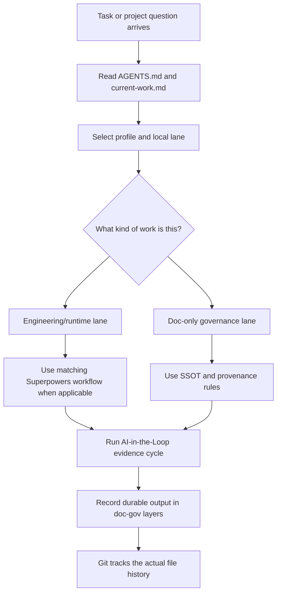

# Project Governance System

Central upstream for PieAI project documentation governance, task routing, and workflow integration profiles.

This repository is not a finished public package yet. It is the **single source of upstream design** for the system currently proven in Supa and being adapted into PieFlow and PieIP.

## Positioning

Project Governance System is an **AI-native governance layer for project documentation and agent work artifacts**.

It does not replace Git, AGENTS.md, or Superpowers:

- Git records file history: what changed, when, and by whom.
- AGENTS.md gives project-specific instructions to coding agents.
- Superpowers provides engineering workflows such as brainstorming, TDD, debugging, planning, and verification.
- Project Governance System decides where durable AI-created artifacts belong, what counts as current truth, which workflow depth a task needs, and how finished or stale documents retire.

Beginner version:

> Git is the storage and history system. Superpowers is the engineering playbook. Project Governance System is the project librarian and traffic desk: it tells agents where to put things, which shelf is current, when a plan is completed, and when old material belongs in the archive.

This matters because AI agents can create useful specs, plans, decisions, and research quickly, but without a lifecycle those files become clutter. The goal is not more ceremony. The goal is one clear place for current truth, one small router for task depth, and one validation layer that keeps AI-generated documentation from piling up into noise.



## What This System Answers

| Question | Answered by |
| --- | --- |
| Where should an AI-generated spec, plan, decision, or reference go? | `doc-gov`, `starter/`, and project-local `docs/` layers |
| Which document is current truth? | frontmatter, `canonical`, lifecycle status, and `current-work.md` |
| Should this task be lightweight, doc-only, TDD, or Directed Development? | `routing/` plus the project-local lane profile |
| Should Superpowers run here? | the selected profile and `integrations/superpowers.md` |
| Is the router/profile/Superpowers wiring still connected? | `doc-gov router-check` |
| What happens after a plan is done? | `completed` status and completed folders, not active-plan pileup |
| What stays local to a product project? | project-local canon, runtime truth, verification ladders, and lane wording |

## What Belongs Here

| Layer | Purpose | Example |
| --- | --- | --- |
| `packages/doc-gov/` | CLI, schema, lifecycle, templates, validation logic | `completed` status, manifest scan, link checks |
| `starter/` | New-project starter files | `docs/`, `governance/`, `AGENTS.template.md` |
| `shared-rules/` | Project-agnostic AI rules | SSOT, AI-in-the-Loop |
| `routing/` | Project-agnostic task routing algorithms | engineering, doc-only |
| `integrations/` | How this system cooperates with external workflows | Superpowers, Directed Development |
| `profiles/` | Optional adoption profiles by project type | engineering-runtime, doc-only |
| `examples/` | Reference implementation notes | Supa, PieFlow, PieIP |

## What Does Not Belong Here

- Supa Phase03 gameplay truth.
- PieFlow v4 product rules.
- PieIP character, script, or asset canon.
- A fork or copy of the Superpowers plugin.
- The body of the Directed Development skill.

Those are project-local or external systems. This repo only defines how projects should integrate with them.

## Current Adoption Model

Stage 0 is intentionally conservative:

1. This repo records the upstream contract.
2. Projects keep their local working copies.
3. AI-assisted migrations compare a project against the matching profile.
4. After Supa and PieFlow both validate the same lifecycle, the package can become the install source.

Do not silently replace project-local governance with this repo. Use the adoption guides and run each project's doc checks.

For migration steps, read `docs/reference/adoption/adoption-playbook.md`.

## Starter Template Vision

This repo can become a new-project starter for AI-assisted work, but only in stages:

1. Today: use it as the upstream design and compare projects against the matching profile.
2. Next: add scripted migrate/check support so projects can update without hand-copying.
3. Later: publish package and init commands for new projects.

Do not treat the starter as a magic install. A useful project still needs local truth: its product canon, runtime proof commands, asset provenance rules, and current work index. The central system supplies the shelves and guardrails; each project supplies the actual content.

## Project Profiles

| Project | Profile | Uses routing? | Uses Directed Development? |
| --- | --- | --- | --- |
| Supa | `profiles/engineering-runtime/` plus Supa-local game rules | Yes, engineering routing | Yes, for mixed product/runtime work |
| PieFlow | `profiles/engineering-runtime/` | Yes, engineering routing | Yes, for mixed app/runtime work |
| PieIP | `profiles/doc-only/` | Yes, doc-only routing | No by default |

## Key Lifecycle Decision

Normal documents use:

```text
draft -> active -> completed -> stable -> superseded -> archived
```

`completed` is for execution artifacts that finished but remain useful as proof history, especially `docs/plans/completed/**`.

`completed` is not the same as `archived`:

- `completed`: no longer active, still useful proof/history, may remain canonical.
- `archived`: retired historical material, must be `canonical: false`.

Decision documents still use:

```text
proposed -> accepted -> rejected | superseded
```

## How A Local Improvement Flows Upstream

When a project discovers a better rule:

1. Decide whether it is **core**, **profile**, or **project-local**.
2. Core changes go to this repo first.
3. Profile changes update `profiles/**`.
4. Project-local changes stay in the project.
5. Other projects upgrade by comparing against the central profile, not by re-inventing the rule.

Example: Supa's active-plan pileup revealed a core lifecycle gap. The fix is `completed`, so it belongs in `packages/doc-gov/` and the starter templates, not only in Supa.

## Minimality Rule

This repo should remain a thin viable platform:

- keep only two profiles until a third is proven by multiple projects
- keep product/game/app truth out of the central repo
- keep Superpowers external and documented as an integration
- keep Directed Development as an optional workflow integration, not a mandatory default path
- prefer one-page routing rules over layered methodology docs
