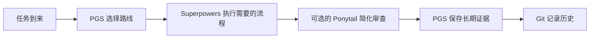
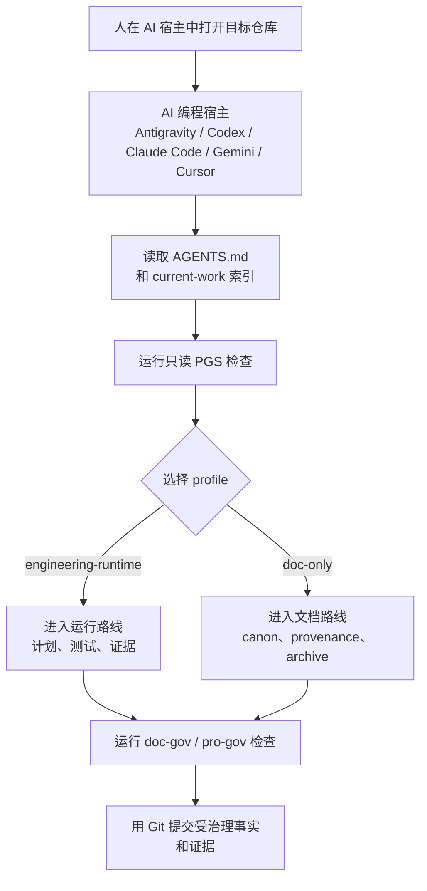

# Project Governance System

[](https://github.com/PieAIStudio/ProjectGovernanceSystem/actions/workflows/docs-check.yml)
[](https://www.npmjs.com/package/@pieai/pro-gov)
[](https://www.npmjs.com/package/@pieai/doc-gov)

[English](README.md) | **[简体中文](README.zh-CN.md)** | [日本語](README.ja-JP.md) | [Español](README.es.md) | [Français](README.fr.md) | [Deutsch](README.de.md)

<p align="center">
  
</p>

> 英文版是内容的唯一原文。如果翻译与英文版出现差异，请以
> [README.md](README.md) 为准。

**Project Governance System（PGS）让一个长期由 AI 协助的项目，过了很多天、
换了很多次 AI 会话以后，仍然容易理解、容易验证，也容易继续。**

AI 可以很快生成计划、需求说明、规则、报告和代码。但如果没有共同的管理方法，
昨天很有用的文件，很快就会变成一堆互相冲突的说明。PGS 给需要长期保留的 AI
产物安排清楚的位置，为每种任务选择合适的工作深度，并检查项目的防护措施是不是真的
连上了。

它故意保持轻量。它与 Git、`AGENTS.md`、
[Superpowers](integrations/superpowers.md) 和可选的
[Ponytail](integrations/ponytail.md) 配合，而不是试图取代它们。

## 为什么需要 PGS

想象一下：你三周后重新打开一个 AI 项目。

里面有四份计划、两份都叫“最终版”的需求说明、不同 AI 工具复制出来的几套规则，
还有一份不知道是否仍符合当前代码的报告。AI 能读完它们，却不能凭空知道哪一份仍然
代表现在的事实。

PGS 解决的就是这种“项目失忆”和“文件越积越乱”的问题：

- 当前事实有一个清楚的位置；
- 草稿、进行中的工作、已经完成的证据和退役材料都有生命周期；
- 路由规则会判断任务应该走轻量流程还是工程流程；
- 检查工具会发现坏链接、过期清单、缺失的 Git hooks 和没有接完整的 CI；
- 修改文件前，可以先只读检查项目；
- 本地技能和规则通过可审查的明确计划安装。

目标不是增加表格和手续，而是少花时间追问：“我到底该相信哪份文档？”

## 30 秒理解它

把项目想成一栋忙碌的大楼：

| 系统 | 日常比喻 | 工作 |
| --- | --- | --- |
| Git | 监控录像和历史账本 | 记录谁在什么时候改了什么。 |
| `AGENTS.md` | 大门口的进入说明 | 告诉 AI 怎样进入这个具体项目。 |
| PGS | 图书管理员、交通调度台和验收站 | 整理长期事实、给任务分流，并检查防护措施。 |
| Superpowers | 施工流程 | 负责头脑风暴、计划、测试驱动开发、调试、验证和 worktree 纪律。 |
| Ponytail | 可选的成本和复杂度顾问 | 质疑不必要的代码和结构，但不能取消需求和验证。 |



PGS 决定**工作应该放在哪里、需要走哪条路线**；Superpowers 决定**工程工作怎样
有纪律地进行**；Ponytail 可以追问**实现能否更精简**；Git 记住最终发生的修改。

## 一个具体例子

小雅正在用两个 AI 编程工具制作一款小应用。

使用 PGS 之前：

1. 一个 AI 写了 `plan-final.md`。
2. 另一个 AI 又创建了 `new-plan-final-v2.md`。
3. 已经完成的计划仍留在“进行中”文件夹。
4. 新会话同时读到两份计划，选错了那份。
5. 团队只好重新调查现在到底做到哪一步。

使用 PGS 之后：

1. `AGENTS.md` 把 AI 带到项目路由和当前工作索引。
2. 当前需求说明和计划放在受治理的位置。
3. 完成的计划进入 `docs/plans/completed/`，作为历史证据。
4. `doc-gov` 检查文档状态、链接、自动生成的清单、hooks 和 CI 接线。
5. 后来的 AI 会话能找到当前路线，不需要猜。

PGS 不替小雅做产品决定。它让项目的记忆足够可靠，使小雅和 AI 可以一起做下一个决定。

## 你会得到什么

### `@pieai/doc-gov`：验收机器

`doc-gov` 是一个 CLI，也就是人、AI 或 CI 都能运行的一条命令。它检查：

- 文档元信息、生命周期和唯一事实；
- 路由和 profile 是否完整；
- 自动生成的 manifest 是否过期；
- 本地 Markdown 链接；
- 本地 Git hooks 和 GitHub Actions 是否接好；
- 项目是否已经适合进行只读迁移检查。

### `@pieai/pro-gov`：项目安装工具箱

`pro-gov` 负责分发和检查：

- 项目治理 starter 文件；
- `engineering-runtime` 和 `doc-only` 两种 profile；
- 只读的初始化预览和同步比较；
- 项目信号发现与 agent 资产推荐；
- ProjectLens 风格的本地检查和报告；
- 使用完整 PGS 仓库时，可审查的 agent 资产安装计划。

### 两种项目 profile

| Profile | 适合 |
| --- | --- |
| `engineering-runtime` | 应用、游戏、服务、浏览器产品以及其他有运行行为的项目。 |
| `doc-only` | 研究、写作、知识产权、AI 媒体和以资产为主的项目。 |

Profile 改变的是工作路线，不是项目自己的产品事实。应用规则、故事设定、运行配置、
提示词和源资产，仍然留在拥有它们的项目里。

## 这些部分怎样配合

1. AI 先读取 `AGENTS.md`。
2. PGS 从 `docs/governance/agents-routing/` 选择合适的 profile 和工作路线。
3. 需要工程纪律时，Superpowers 在这条路线内执行。
4. 需要一次受控的简化审查时，才明确调用 Ponytail。
5. 需要长期保留的需求说明、计划、决策和参考资料进入受治理的位置。
6. `doc-gov` 和 `pro-gov doctor` 检查这套系统是否真的接好，而不只是文档里说接好了。

PGS 使用 **SSOT**，即“单一事实来源”：一个长期事实应该只有一个权威住所。其他文件
可以概括并链接它，但不应该变成互相竞争的副本。

## 在 AI 宿主中使用 PGS

PGS 不是单独打开的项目管理软件，而是通过你已经在用的 AI 编程宿主来使用。这个宿主
可以是 Antigravity、Codex、Claude Code、Gemini CLI、Cursor，或者其他能够打开
本地仓库并读取项目文件的 agentic coding 环境。

基本循环很简单：

1. 在 AI 宿主中打开**目标项目**。
2. 让 AI 先读取 `AGENTS.md`。如果目标项目还没有采用 PGS，就先用只读的
   `pro-gov` 命令检查它，不要急着改文件。
3. 让 PGS 选择 profile：应用、游戏、服务和浏览器产品用 `engineering-runtime`；
   研究、写作、设定、AI 媒体和资产治理用 `doc-only`。
4. 让 AI 在选定路线中研究、迁移或继续目标项目。
5. 用 `doc-gov` 和 `pro-gov doctor` 证明链接、manifest、hooks、profiles 和 CI
   接线仍然符合规则。



一个好用的第一条提示词是：

```text
先读取 AGENTS.md。然后用 PGS 的只读模式检查这个项目。告诉我它适合哪种
profile，当前事实来源在哪里，哪些内容看起来过期或冲突，以及开始改文件之前应该
通过哪些验证命令。
```

把 PGS 应用到另一个项目时，不要把这个上游仓库里的私人或镜像第三方 agent 资产
复制过去。除非你正在完整本地 PGS checkout 中有意应用受管理的 agent 资产，否则应
使用公开包、starter 文件和经过审查的迁移计划。

## 安全地试用

你可以先检查 PGS，而不允许它覆盖项目。

需要 Node.js `22.12.0` 或更高版本。

```bash
pnpm dlx @pieai/pro-gov assets list
pnpm dlx @pieai/pro-gov assets discover --target .
pnpm dlx @pieai/pro-gov assets recommend --target .
pnpm dlx @pieai/pro-gov lens inspect --target .
pnpm dlx @pieai/pro-gov init --profile engineering-runtime --dry-run
pnpm dlx @pieai/doc-gov migrate --profile engineering-runtime --check
```

当前版本的 init 和 sync 路径是只读的。它们只展示已有、缺少或不同的内容，不会偷偷
重写另一个项目的路由。

在项目中正式安装：

```bash
pnpm add -D @pieai/pro-gov @pieai/doc-gov
pnpm pro-gov doctor
pnpm doc-gov check
```

迁移已有项目文件前，请先阅读
[采用手册](docs/reference/adoption/adoption-playbook.md)。

## 选择 Profile

项目有代码或运行行为，需要测试和执行证据时，选择 `engineering-runtime`。

项目的主要事实是研究、写作、设定、媒体或资产时，选择 `doc-only`。Doc-only
项目遇到真实编程任务时仍然可以使用工程工具，只是默认不会背上完整工程流程。

不确定时先选择 `doc-only`；等项目真的有需要证明的运行行为，再增加工程路线。

## 推荐的配套工具

工程或运行类项目推荐使用 Superpowers。它负责头脑风暴、实施计划、测试驱动开发、
调试、完成前验证和隔离 worktree 工作流。

Ponytail 适合安装成按需使用的复杂度顾问。全局模式保持 `off`；先在一个低风险的
隔离任务里测试 `lite`，确认没有漏掉需求和验证后，再考虑可选的 `full` 压力测试。
如果更小的修改丢掉了需求、测试、安全、无障碍或证据，那就不是胜利。

具体推荐强度和不同项目类型的区别，请看
[推荐的 Agent 工具](docs/reference/adoption/recommended-agent-tooling.md)。

## PGS 不做什么

PGS 不会：

- 取代 Git、`AGENTS.md`、Superpowers 或 Ponytail；
- 自动理解并重写每一个项目；
- 把所有 Markdown 文件都搬进 `docs/**`；
- 默认把生成媒体、产品提示词、运行笔记和源码包文档当成受治理文档；
- 在公开 npm 包中发布私人或第三方 agent 技能正文；
- 承诺固定比例的代码、token、时间或成本节省；
- 偷偷安装、启用、更新或删除外部 AI 插件。

公开包刻意保持保守。先只读检查、后开放写入，是因为治理工具本身不应该成为新的破坏源。

## 仓库地图

| 路径 | 用途 |
| --- | --- |
| `packages/doc-gov/` | 文档验证 CLI 和生命周期检查。 |
| `packages/pro-gov/` | 项目级分发、检查和只读采用 CLI。 |
| `starter/` | 受治理项目的参考文件。 |
| `profiles/` | 可复用的项目类型路线。 |
| `docs/governance/` | 核心文档和路由契约。 |
| `docs/policy/` | PGS 自己的开发和采用策略。 |
| `docs/reference/adoption/` | 迁移、关系、发布和工具指南。 |
| `integrations/` | 与 Superpowers、Ponytail 和 Directed Development 的边界。 |
| `agent-assets/` | 技能、规则、命令和 bundle 的本地上游登记库。 |

完整仓库包含袁飞的私人资产和镜像的第三方 agent 资产。公开 npm 压缩包会故意排除
这些正文。

## 给贡献者

AI 应该从 `AGENTS.md` 开始，而不是从这篇 README 开始。这篇 README 是给人看的介绍。

本地仓库检查：

```bash
pnpm install
pnpm typecheck
pnpm test
pnpm build
pnpm doc-gov doctor
pnpm pro-gov doctor
```

核心生命周期、schema、路由、starter 和可复用 CLI 的修改，应该先进入这个中央仓库。
具体产品的事实仍然留在下游项目。

## 快速问答

| 问题 | 回答 |
| --- | --- |
| 这是一个项目管理 App 吗？ | 不是。它是管理长期 AI 项目产物的轻量治理与分发层。 |
| 它会取代 Git 吗？ | 不会。Git 记录历史；PGS 整理事实并验证协作结构。 |
| 必须安装 Superpowers 吗？ | 不是必须，但工程或运行类工作推荐使用。 |
| 应该全局打开 Ponytail 吗？ | 不应该。保持 `off`，先在隔离任务里测试 `lite`。 |
| `pro-gov init` 会覆盖项目吗？ | 当前版本不会。支持的 init 路径是只读的 `--dry-run`。 |
| 朋友可以使用吗？ | 可以。公开包是 `@pieai/pro-gov` 和 `@pieai/doc-gov`，不包含私人和第三方技能正文。 |

当 AI 已经足够快，真正的问题变成“第十份计划、第五次 AI 会话和下一个接手的人还能否
看懂这个项目”时，PGS 就开始发挥价值。
