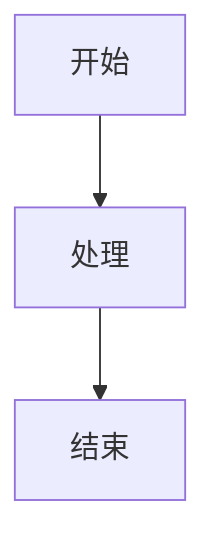

# 反模式样例 + 跨步骤陷阱

> 写文档前/扫描时若不确定输出质量，对照本文件检查。

## 反模式样例（避免这些输出）

### ❌ 抽象漂浮型

```markdown
# concept-zustand-state-management Zustand 状态管理

Zustand 是一个小而美的状态管理库，采用 store 模式，让组件订阅状态变化...
```

**问题**：没有项目代码锚点，像维基百科条目。读完用户依然不知道**自己项目里哪里用到了**。

**修正**：增加 `## 在 PieFlow 里它是怎么用的` 一节，引用 `src/stores/useGameStore.ts:14` 的真实代码片段。

### ❌ 把操作当知识型

```markdown
# workflow-fix-typo 改错别字流程

1. 打开文件 → 2. 找到错别字 → 3. 改掉 → 4. 保存
```

**问题**：这是机械操作，Phase 3 评分应该给 A=1/B=1=1，根本不该落盘。落盘会稀释 vault。

### ❌ Mermaid 糊弄型



**问题**：节点名空洞，不传达任何信息。Mermaid 的价值在**结构化**，节点必须说出具体的东西（"用户点击提交" / "Zustand store 更新" / "React 触发重渲染"）。

### ❌ 类比空洞型

> "Zustand 就像一种状态管理机制，帮你管理应用的状态。"

**问题**：这不是类比，是同义反复。真正的类比要跳出技术语境：

> "Zustand 就像教室里的一块公共黑板——任何人走过去都可以看上面写着什么，也可以直接擦掉重写。React 组件就是进出教室的学生，黑板变了他们自然会注意到。"

---

## Common Mistakes（跨步骤的全局陷阱）

| 错误 | 修正 |
|---|---|
| Phase 1 阶段就开始写文件 | Phase 1 只对话输出，落盘由用户 Phase 2 显式触发 |
| 把 vault 误判为 SOURCE_PROJECT | Step 0 先分清两个角色 |
| 编造代码示例假装是项目里的 | 没找到就明说"未找到对应代码"，不硬编 |
| 文档里写了 YAML frontmatter | 从 `# 标题` 直接开始，关系靠正文 `[[双链]]` |
| Phase 3 对所有话题都打高分 | 严格二维评分，总分≤3 默认跳过，宁缺毋滥 |
| Phase 3 不等确认就批量创建 | 3.3 汇报后必须等用户明确"确认" |
| Step 2.5 只机械加 1-2 条固定数量链接 | 按启发式判断关系强度，数量因情况而定 |
