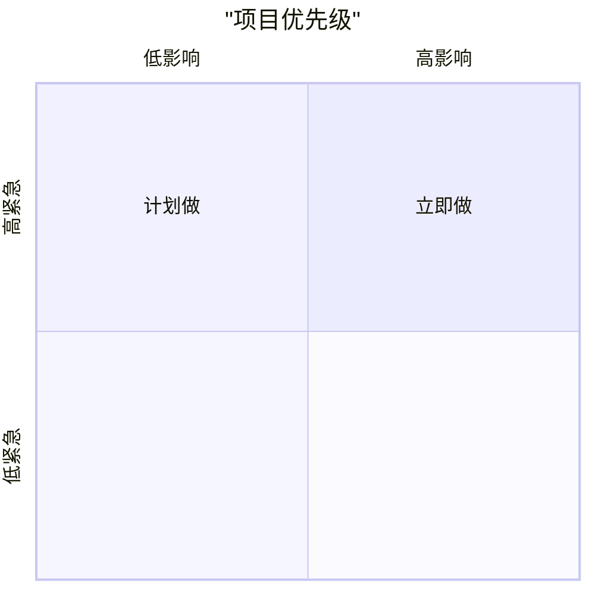
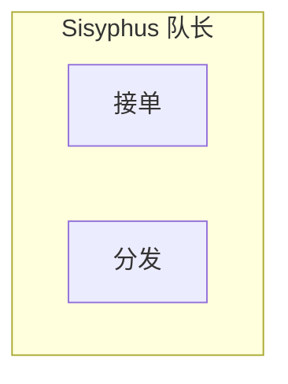
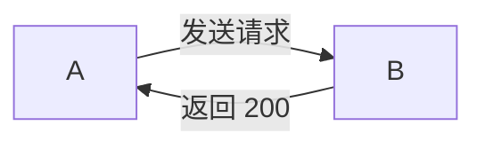
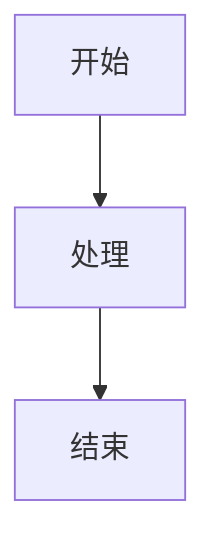
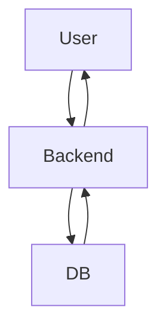
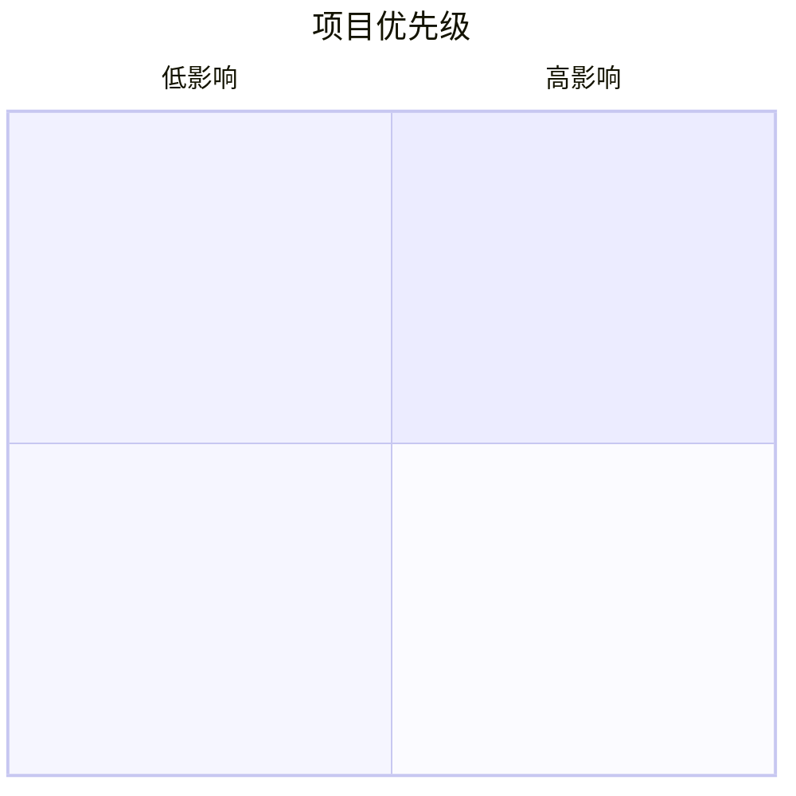

# Mermaid Diagrams

## 为什么这个技能存在

Mermaid 是文本化的图表 DSL，直接嵌在 Markdown 里就能渲染。但它有一堆**反直觉的语法陷阱**（尤其中文支持），以及**24 种图种选型不对会把内容画歪**。这个技能把这些坑一次性讲清楚，让 Claude 画图不踩雷、不选错。

这个技能是 [`knowledge-node`](../knowledge-node/) 的**下游支撑**——知识沉淀文档每篇至少要一张 Mermaid 图，所以这俩经常同时触发。

---

## 选图种的原则（不只是查表）

图种选错是最大的浪费。先判断**内容在讲什么关系**：

| 内容本质 | 对应图种 | 判断依据 |
|---|---|---|
| 事情先后发生 / 按步骤流转 | `flowchart` | 节点是"事"，箭头是"然后" |
| 多方之间时序互动（谁先谁后、谁回复谁） | `sequenceDiagram` | 节点是"角色"，箭头是"消息" |
| 一个东西在不同状态间切换 | `stateDiagram-v2` | 节点是"状态"，箭头是"触发" |
| 层级 / 从属结构 | `mindmap` 或 `classDiagram` | 节点是"概念"，箭头是"包含" |
| 数据结构之间的字段/关联 | `erDiagram` | 节点是"表/类型"，箭头是"关系" |
| 两个方案对比 / 四象限定位 | `quadrantChart` | 二维空间定位 |
| 时间轴上的事件 | `timeline` | 按时间排列里程碑 |
| 项目排期 | `gantt` | 带起止时间的任务条 |
| 多维能力评分 | `radar-beta` | 不同维度的相对强弱 |
| 分布 / 占比 | `pie` | 仅当真的是百分比构成 |

**红旗信号（你可能选错了）**：
- 在写 flowchart 但发现节点是 "用户" "后端" "数据库" → 应该是 `sequenceDiagram`
- 在写 flowchart 但箭头要表达"状态A → 状态B" 不是事件 → 应该是 `stateDiagram-v2`
- 在写 sequence 但没有异步 / 消息往返 → 其实是普通流程，用 `flowchart`
- 在写 mindmap 但想表达"因为 A 所以 B" → 因果不是层级，用 `flowchart`

**什么时候别用 Mermaid**：
- 纯数字对比（5 列以上）→ 用 Markdown 表格
- UI 界面示意 → Mermaid 画不出，用截图或文字描述
- 太复杂（超过 20 个节点）→ 拆成多张小图，Mermaid 渲染会糊

详细语法见 [`references/diagrams/`](references/diagrams/) 下对应文件。

---

## 常见渲染错误 & 修法

遇到 Mermaid 不渲染 / 报错，先按下面清单过一遍：

| 症状 | 真实原因 | 修法 |
|---|---|---|
| label 里有引号，整个图裂开 | 嵌套 `"` 没转义 | 去掉内层引号，或用 `&quot;` |
| `quadrantChart` 里中文不显示 | Mermaid 要求 quadrant 所有 label 必须**显式加双引号** | `title "项目优先级"` 全加引号 |
| `subgraph` 报错 `Parse error` | subgraph ID 不能直接是中文 | 用 `subgraph Alice["Alice 队长"]` 形式 |
| 中文变成 `\u5B89` 乱码 | 来源系统做了 Unicode 转义 | 直接写真实中文字符 |
| 图显示一半然后断了 | subgraph 忘了 `end` | 每个 subgraph 必有匹配 `end` |
| 箭头 label 里有 `:` 报错 | `:` 跟 label 语法冲突 | 用 `\:` 或改写表达 |
| 节点 id 含空格报错 | 空格 id 不合法 | id 用下划线，显示文本放 `[]` 里 |
| Obsidian 里 渲染不出来但 mermaid.live 正常 | Obsidian 的 Mermaid 版本偏旧，部分新图种（`architecture`, `radar-beta`, `packet`）可能不支持 | 换图种，或用 `![[file.png]]` 嵌入静态图 |

完整 debug 清单：[`references/quick-ref.md`](references/quick-ref.md)

---

## 中文支持的要点

**`quadrantChart` 所有 label 必须加双引号**（这是最常见的坑）：



**`subgraph` 中文标题用 ID+Label 形式**：



**箭头标签里的中文一般没问题**，但含 `:` / `"` 要转义：



---

## 可访问性（accTitle / accDescr）

给图加无障碍描述，屏幕阅读器能读出来。

**支持** `accTitle` / `accDescr` 的图种：flowchart、sequence、state、class、ER、git_graph、gantt、requirement、c4、pie。

**不支持**的（别浪费力气加）：mindmap、timeline、quadrant、radar-beta、sankey、user_journey、xy_chart、packet、block、treemap、architecture、kanban。在这些图上方用**斜体段落**代替：

```markdown
*Figure: 项目优先级四象限。X 轴代表影响，Y 轴代表紧急度。*

```mermaid
quadrantChart
    ...
```

---

## 反模式样例

### ❌ 空壳节点


**问题**：节点名零信息。Mermaid 的价值是**结构 + 具体内容**，节点必须说出真实东西（"用户提交表单" / "后端校验 JWT" / "返回 200"）。

### ❌ 图种选错（把时序当流程）


**问题**：出现"返回"箭头 + 三方以上参与者 = 典型 sequence 场景。flowchart 画成环看着乱，`sequenceDiagram` 自带生命线和消息方向更清晰。

### ❌ 一张图塞太多

50 个节点挤在一张 flowchart 里，Obsidian 渲染糊成一团。

**修法**：按子系统拆成 3 张小图，或用 `subgraph` 分组。

### ❌ quadrantChart 中文无引号


**问题**：不加引号 → Obsidian 里显示空白。看起来没错但根本渲染不出。

---

## 模板与详细参考

| 场景 | 位置 |
|---|---|
| 快速套用模板（flowchart / sequence / state / gantt / timeline / quadrant / er / class） | [`templates/`](templates/) |
| 24 种图种的详细语法 | [`references/diagrams/`](references/diagrams/) |
| 快速速查表（语法 cheatsheet） | [`references/quick-ref.md`](references/quick-ref.md) |

**什么时候读 references/**：
- 遇到不熟悉的图种（`sankey`、`c4`、`architecture` 等）→ 先读对应 md
- 常见图种（flowchart / sequence / state）→ 直接按 SKILL.md 本体 + templates/ 写，不需要 dive in

---

## 验证渲染

Obsidian 里：直接切到 preview pane 看效果，是最终渲染环境。

外部验证：https://mermaid.live（官方在线编辑器，语法错误会精确报行号）

命令行验证：
```bash
npx @mermaid-js/mermaid-cli -i diagram.mmd -o diagram.svg
```

**注意**：mermaid.live 能渲染不代表 Obsidian 能渲染，因为 Obsidian 的 Mermaid 版本可能偏旧。以 Obsidian preview 为准。

---

## 相关资源

- 官方文档：https://mermaid.js.org/
- 在线编辑器：https://mermaid.live
- 已知中文相关 issue：#7120（quadrantChart 中文）
