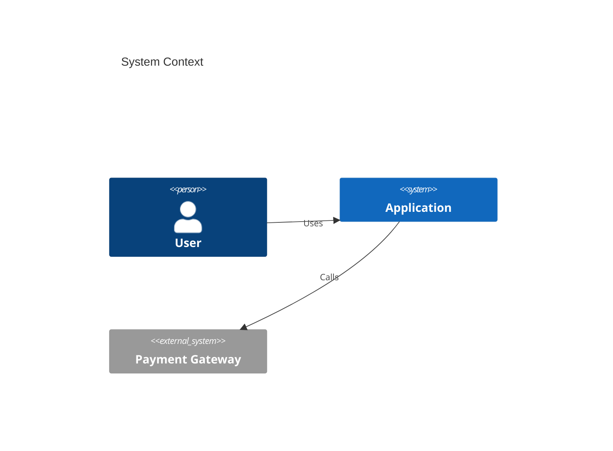
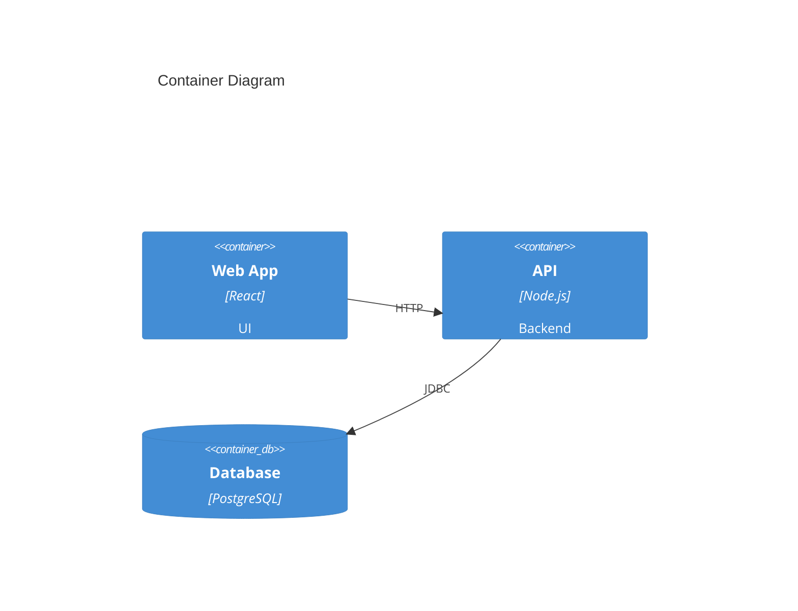

# C4 Diagram

**Keyword:** `C4Context`, `C4Container`, `C4Component`
**Best for:** Software architecture at multiple levels

## System Context

## Container Level

## Levels
- `C4Context` - System context
- `C4Container` - Containers
- `C4Component` - Components