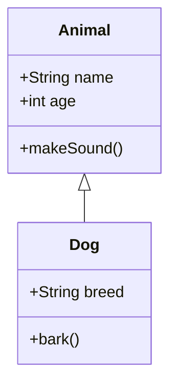
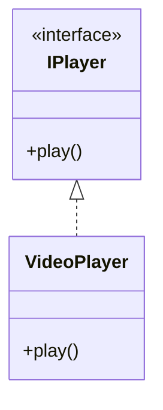

# Class Diagram

**Keyword:** `classDiagram`
**Best for:** Object-oriented design, class hierarchies

## Quick Template

## With Interface

## Relationships
- `<|--` Inheritance
- `*--` Composition
- `o--` Aggregation
- `-->` Association
- `<|..` Realization

## Tips
- `+` public, `-` private
- `<<interface>>` for interfaces
- Show methods with `()`