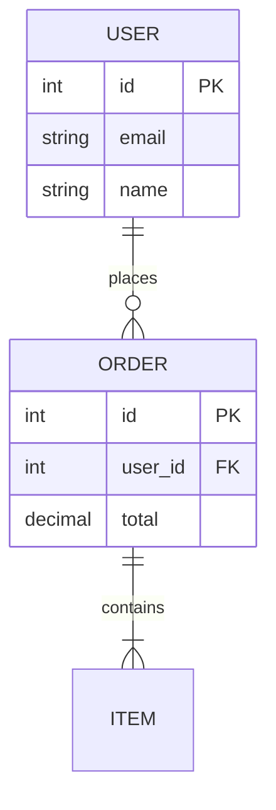

# ER Diagram

**Keyword:** `erDiagram`
**Best for:** Database schemas, entity relationships

## Quick Template

## Relationship Types
- `||--||` One to one
- `||--o{` One to many
- `}o--o{` Many to many

## Cardinality
- `||` Exactly one
- `o{` Zero or more
- `}|` One or more
- `o` Zero or one

## Tips
- PK = Primary Key
- FK = Foreign Key
- UK = Unique Key