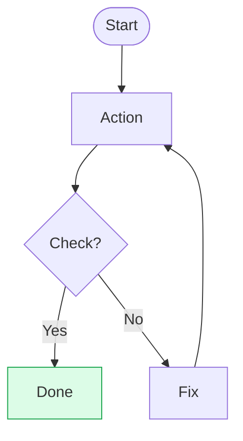

# Flowchart

**Keyword:** `flowchart`
**Best for:** Process flows, decision trees, workflows
**Avoid:** Complex timing (use sequence), state machines (use state)

## Quick Template


## Node Shapes
- `[text]` - Rectangle (process)
- `(text)` - Rounded (start/end)
- `{text}` - Diamond (decision)
- `[(text)]` - Cylinder (database)
- `[[text]]` - Subroutine
- `>{{text}}` - Event

## Directions
- `TB` - Top to bottom
- `LR` - Left to right
- `RL` - Right to left
- `BT` - Bottom to top

## Styling
```mermaid
classDef primary fill:#dbeafe,stroke:#2563eb,color:#1e3a5f
class node1 primary
```

## Tips
- Max 10 nodes per diagram
- Max 3 decision points
- Edge labels 1-4 words
- Use subgraphs for grouping