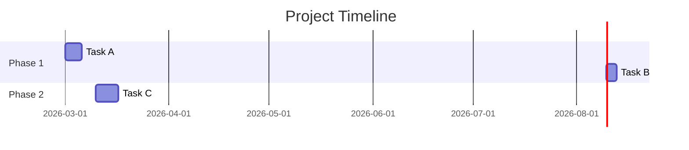
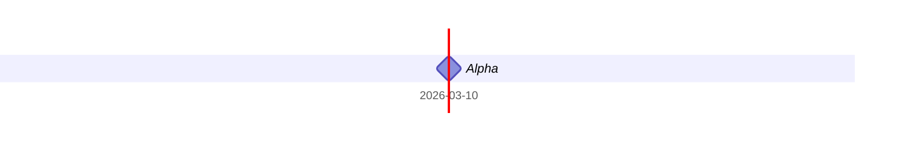

# Gantt Chart

**Keyword:** `gantt`
**Best for:** Project timelines, task scheduling, milestones

## Quick Template

## Date Formats
- `YYYY-MM-DD` - Date
- `YYYY-MM-DD HH:mm` - Date with time
- `2026-03-01` - March 1, 2026

## Dependencies
- `after task_id` - Starts after another task

## Milestones

## Tips
- Duration: `5d` (days), `3h` (hours)
- Use sections to group tasks
- Milestones use `0d` duration