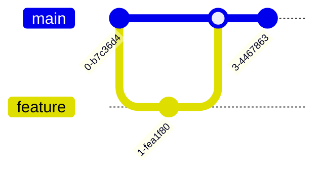
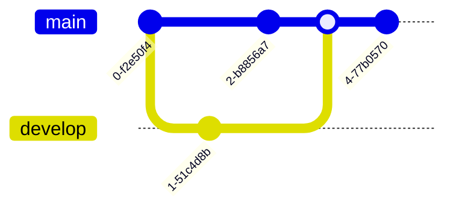

# Git Graph

**Keyword:** `gitGraph`
**Best for:** Branching strategies, version control

## Quick Template

## With Tags

## Commands
- `commit "message"`
- `branch name`
- `checkout branch`
- `merge branch`
- `tag "version"`