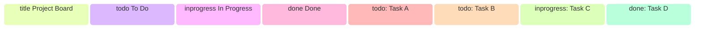

# Kanban Board

**Keyword:** `kanban`
**Best for:** Work item status, task columns

## Quick Template

## With Limits

## Tips
- Columns = swimlanes
- Items listed under column
- Good for agile workflows