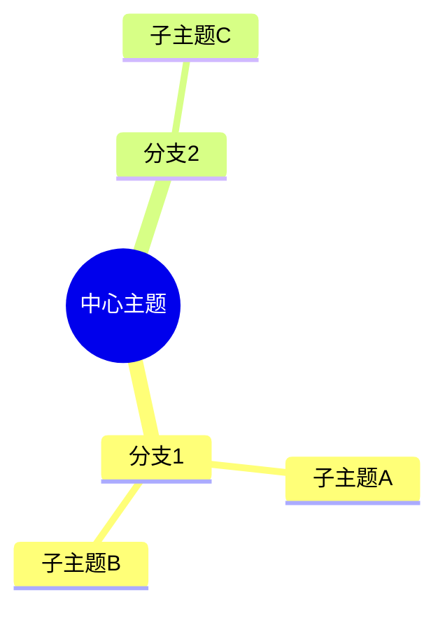
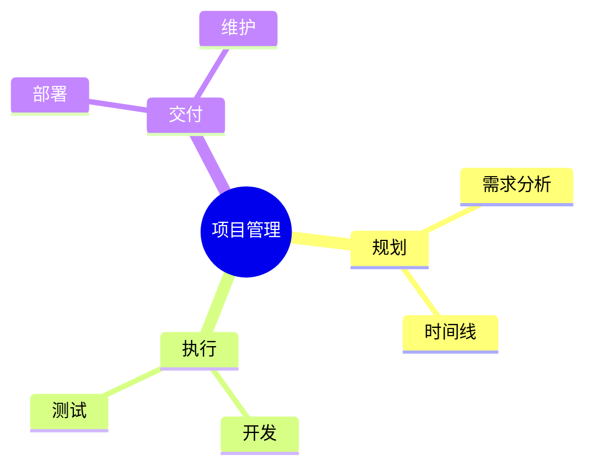

# Mindmap

**Keyword:** `mindmap`
**Best for:** Hierarchical ideas, brainstorming, organization

## Quick Template

## With Content

## Tips
- `((text))` for root node
- Indent for hierarchy
- Chinese works well