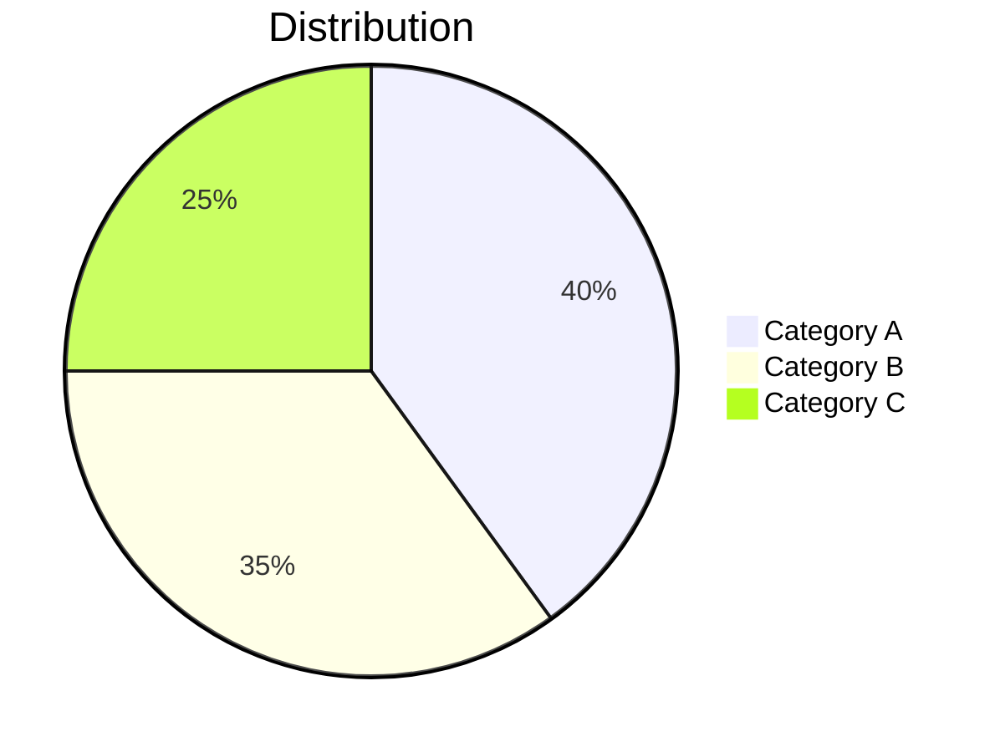
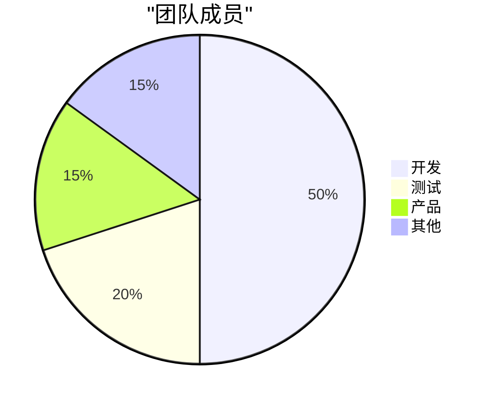

# Pie Chart

**Keyword:** `pie`
**Best for:** Proportions, percentages, distribution

## Quick Template

## Label with Quotes

## Tips
- Quote Chinese labels
- Values sum to any number (not just 100)
- Use for simple proportions only