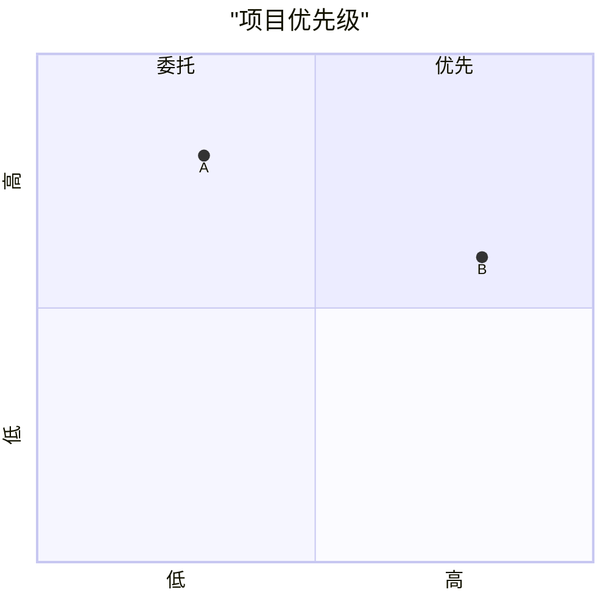
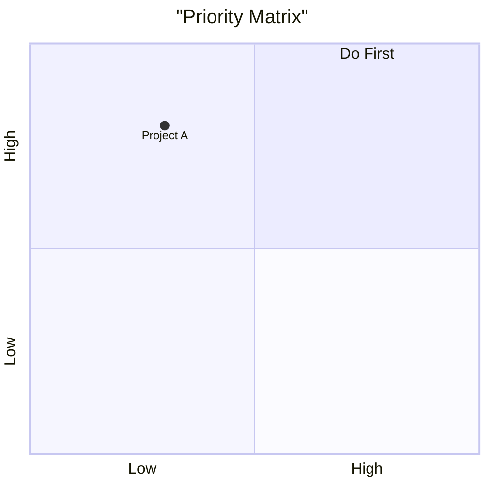

# Quadrant Chart

**Keyword:** `quadrantChart`
**Best for:** Comparison, prioritization, positioning

## ⚠️ CRITICAL: Chinese Must Be Quoted

## English Version

## Values
- x: 0-1 (left to right)
- y: 0-1 (bottom to top)

## Tips
- ALL Chinese text in double quotes
- Values are [x, y] coordinates
- Max 4 quadrants