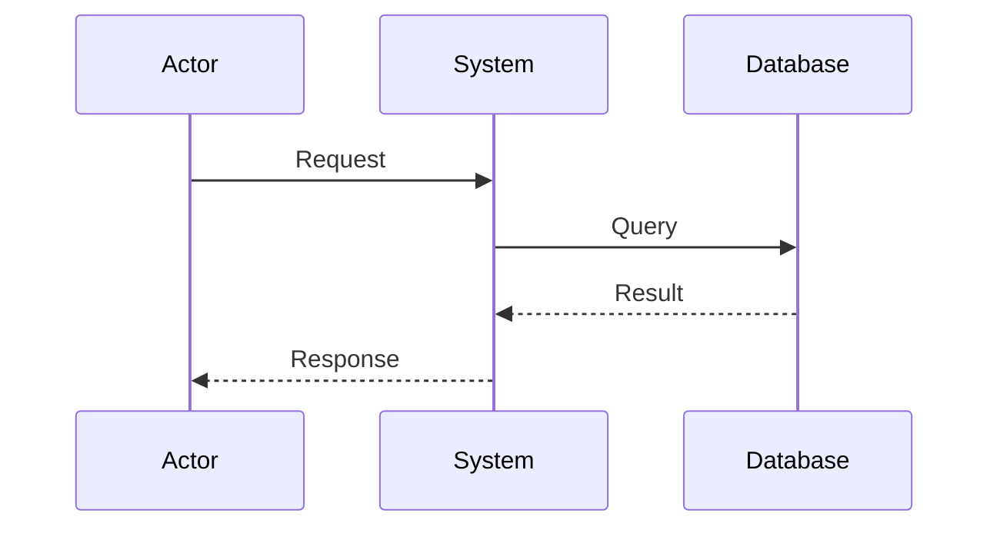

# Sequence Diagram

**Keyword:** `sequenceDiagram`
**Best for:** API interactions, service communication, temporal ordering

## Quick Template


## Message Types
- `->>` Solid arrow (sync)
- `-->>` Dashed arrow (return)
- `->` Open arrow (async)

## Conditional
```mermaid
alt condition
    A->>B: Success path
else
    A->>B: Error path
end
```

## Loops
```mermaid
loop every minute
    A->>B: Check status
end
```

## Tips
- Time flows top to bottom
- Use `participant Alias as Name` for aliases