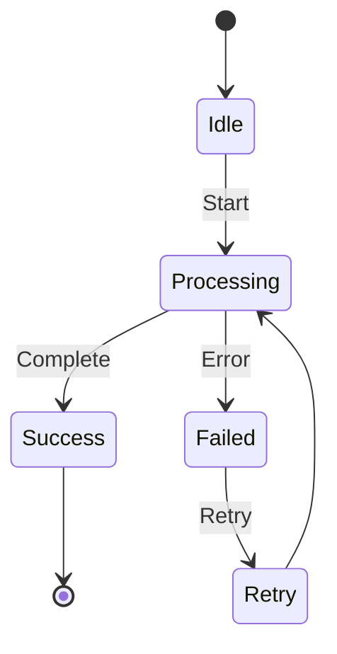
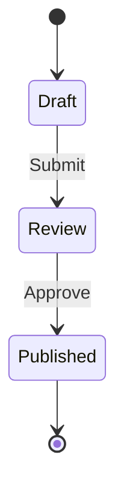
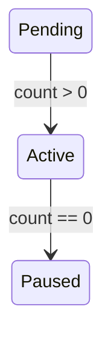

# State Diagram

**Keyword:** `stateDiagram-v2`
**Best for:** State machines, status transitions, lifecycle flows

## Quick Template

## States

## With Guards

## Tips
- `[*]` for start/end states
- Use `: Event` for transitions
- Guards in `[condition]`