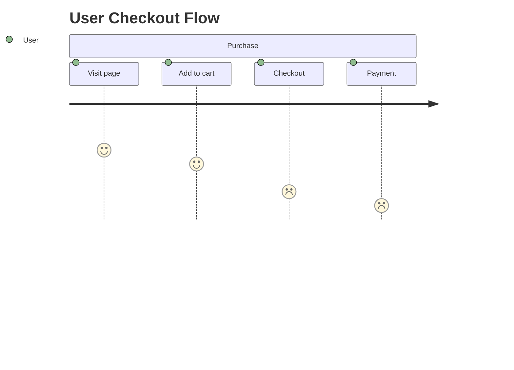

# User Journey

**Keyword:** `journey`
**Best for:** User satisfaction over steps

## Quick Template

## Syntax
- `section Name` - Groups steps
- `Step: rating :Actor`
- Rating 1-5 (5=great, 1=poor)

## Tips
- Rating shows satisfaction
- Good for UX analysis