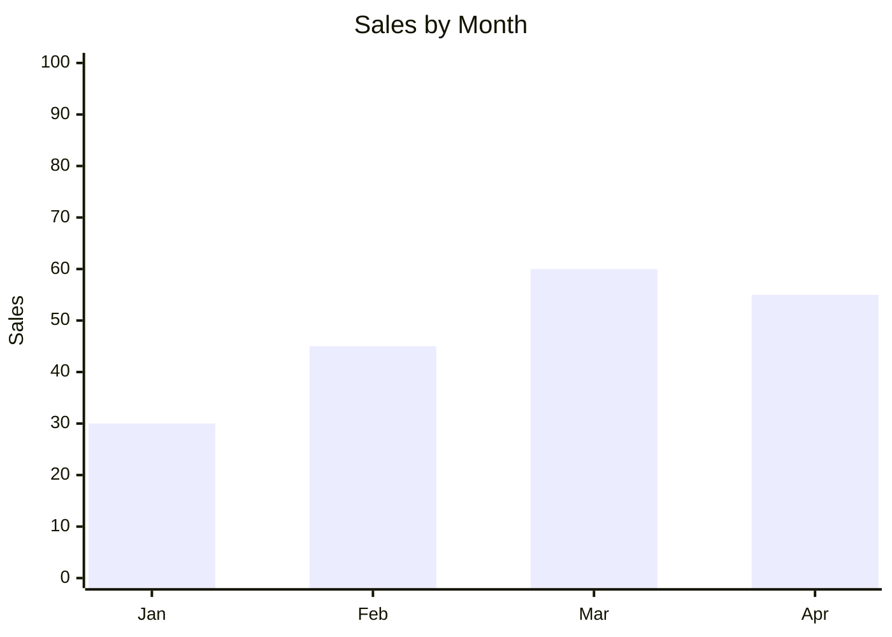

# XY Chart

**Keyword:** `xychart-beta`
**Best for:** Numeric trends, bar/line charts

## Bar Chart


## Line Chart
```mermaid
xychart-beta
    title "Growth Trend"
    x-axis [2020, 2021, 2022, 2023]
    y-axis "Users" 0 --> 1000
    line [100, 300, 600, 900]
```

## Syntax
- `x-axis ["A", "B", "C"]`
- `y-axis "Label" min --> max`
- `bar [values]` or `line [values]`

## Tips
- Use for data visualization
- Mermaid v11.6+ required