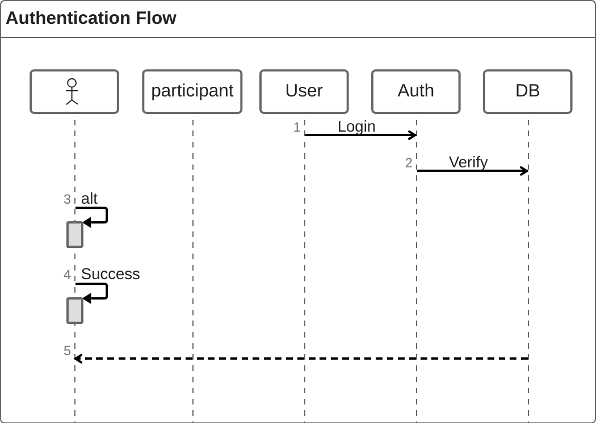

# ZenUML

**Keyword:** `zenuml`
**Best for:** Code-style sequence diagrams

## ⚠️ Note
Requires external plugin. May not render on GitHub. Prefer standard `sequenceDiagram`.

## Quick Template

## When to Use
- Complex code flow
- Full control over sequence

## Better Alternative
Use standard `sequenceDiagram` instead