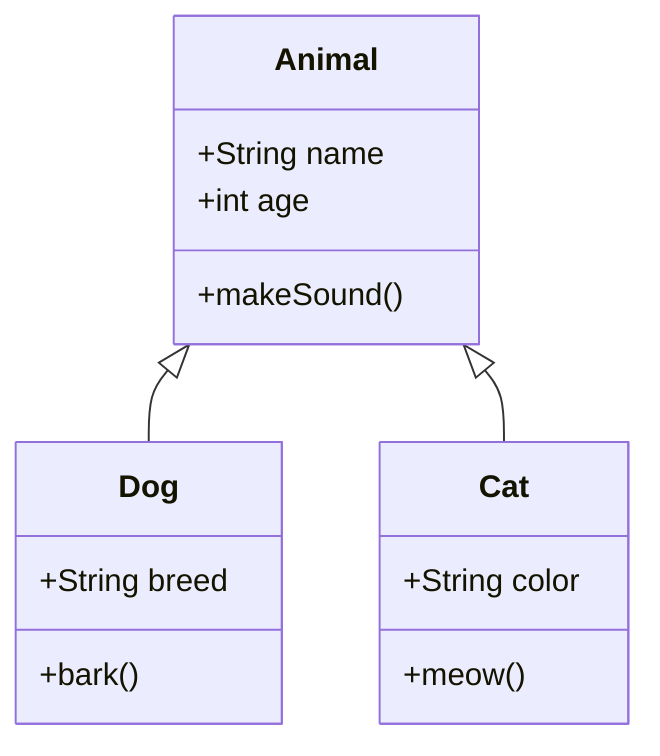
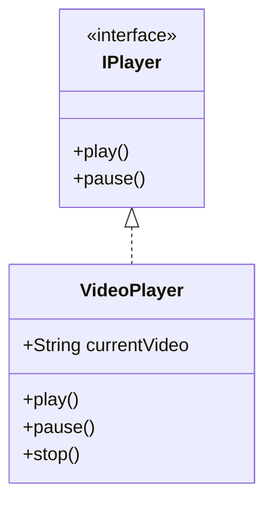

# Class Diagram Template

## When to Use
Object-oriented design, class hierarchies, inheritance relationships

## Basic Template

## With Interfaces

## Relationship Types
- `<|--` Inheritance
- `<|--` Extension
- `*--` Composition (strong ownership)
- `o--` Aggregation (weak ownership)
- `-->` Association
- `--` Link

## Best Practices
- Use `+` for public, `-` for private
- `<<interface>>` for interfaces
- Show methods with parentheses `()`