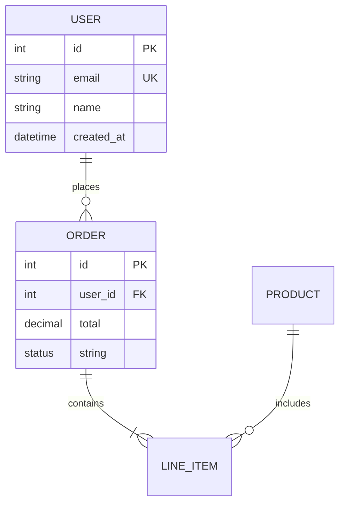

# ER Diagram Template

## When to Use
Database schemas, entity relationships, data modeling

## Basic Template


## Relationship Types
```mermaid
erDiagram
    A ||--|| B : one-to-one
    A ||--o{ B : one-to-many
    A }o--o{ B : many-to-many
```

## Cardinality Symbols
- `||` - Exactly one
- `o{` - Zero or more (many)
- `}|` - One or more
- `o` - Zero or one

## Best Practices
- PK = Primary Key
- FK = Foreign Key
- UK = Unique Key
- Use meaningful entity names