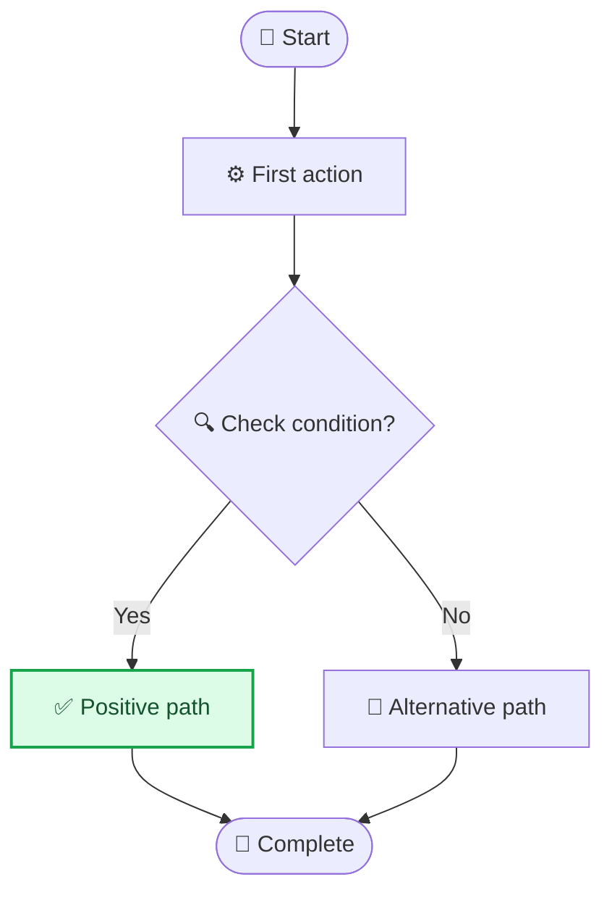
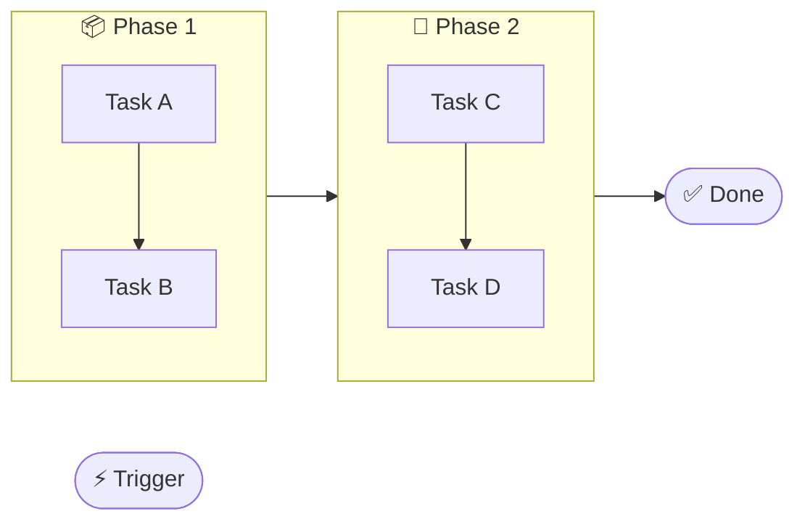

# Flowchart Template

## When to Use
Process flows, decision trees, workflows with branches

## Template


## Common Variations

### With Subgraphs


### Decision Tree
```mermaid
flowchart TD
    start([Start]) --> input{User input?}
    input -->|Valid| process[Process]
    input -->|Invalid| error[Show error]
    process --> check{Check result?}
    check -->|Pass| success[✅ Success]
    check -->|Fail| retry[🔄 Retry]
    retry --> process
    success --> end([End])
```

## Best Practices
- Use TB (top-bottom) for processes, LR (left-right) for pipelines
- Max 10 nodes per diagram
- Max 3 decision points
- Edge labels 1-4 words