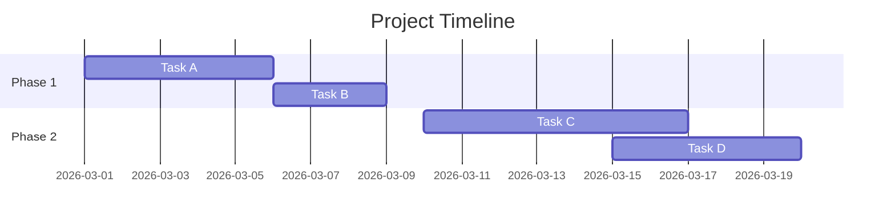
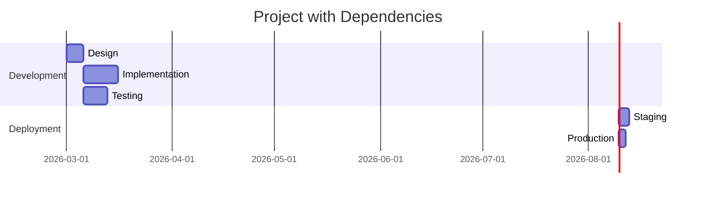
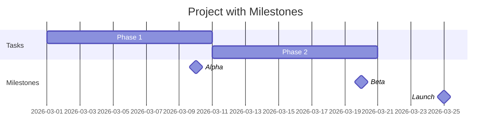

# Gantt Chart Template

## When to Use
Project timelines, task scheduling, milestone tracking

## Basic Template

## With Dependencies

## With Milestones

## Best Practices
- Use `dateFormat YYYY-MM-DD` or `HH:mm`
- Dependencies: `after task_id`
- Duration: `Nd` (days), `Nh` (hours)
- Milestones: `milestone, date, 0d`