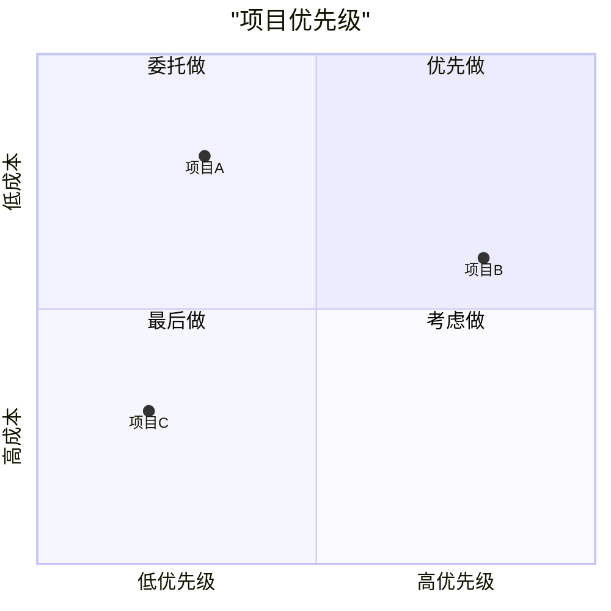
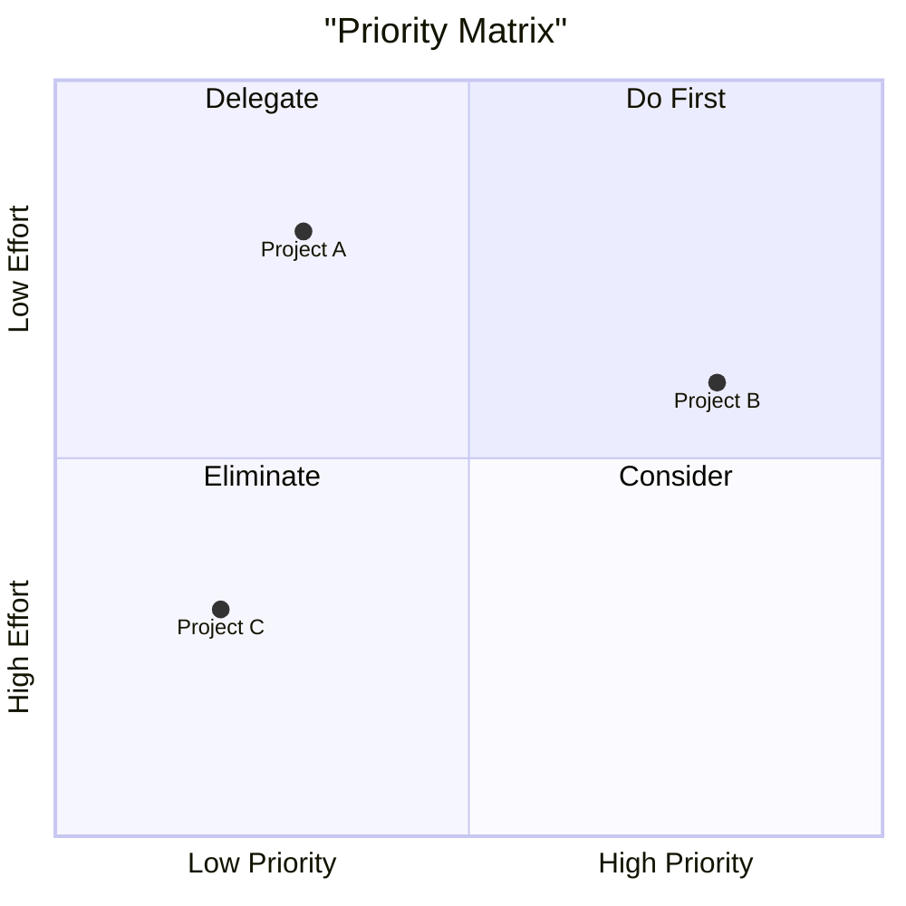

# Quadrant Chart Template

## When to Use
Comparison, prioritization, positioning, categorization

## Basic Template (Chinese - MUST quote)

## English Version

## CRITICAL Rules
- ALL Chinese text MUST be in double quotes
- Title, axis labels, quadrant labels all need quotes
- No quotes = won't render
- Values are [x, y] coordinates (0-1 scale)