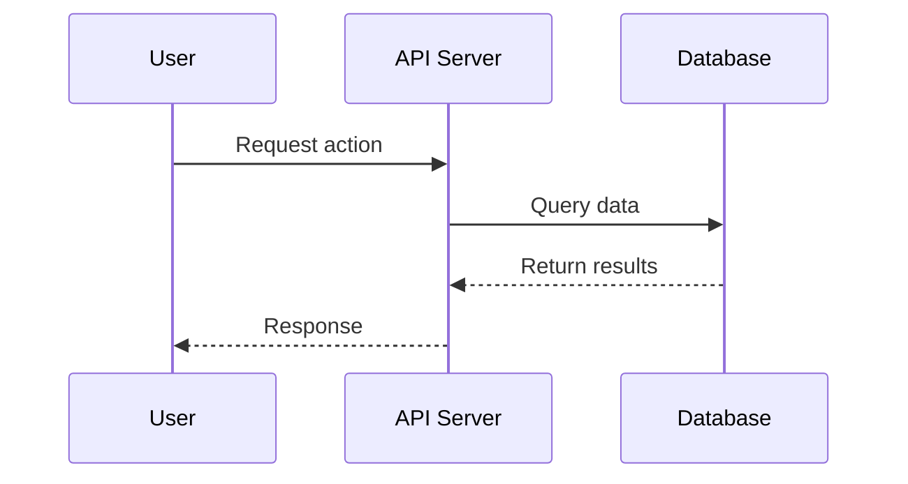
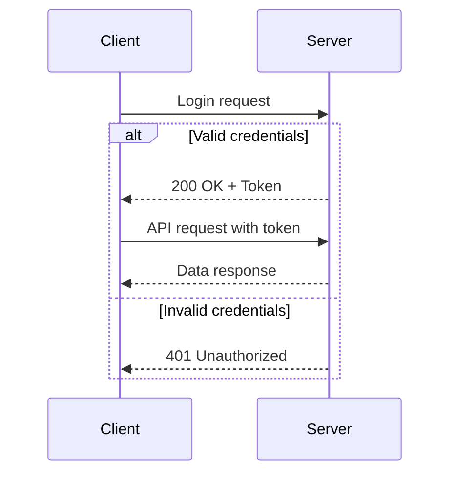
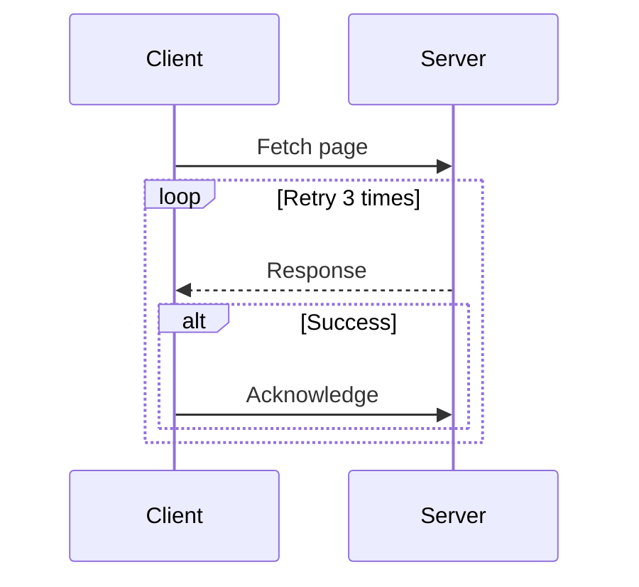

# Sequence Diagram Template

## When to Use
API interactions, service communication, temporal ordering of events

## Basic Template

## With Conditional Logic

## With Loops

## Best Practices
- Actors across top, time flows down
- Use solid arrow for sync, open arrow for async
- Dashed arrows for return messages