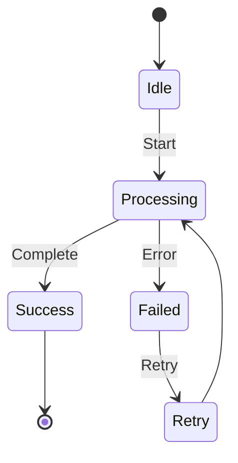
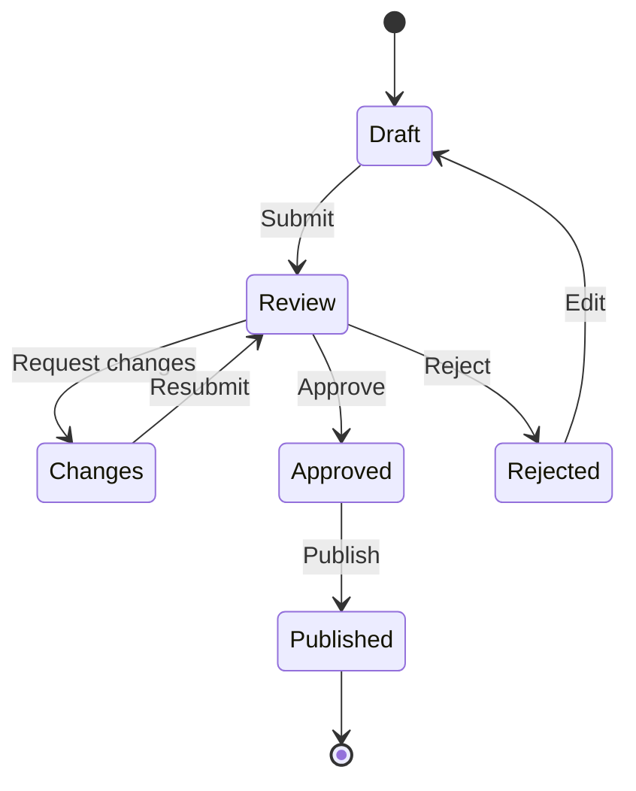
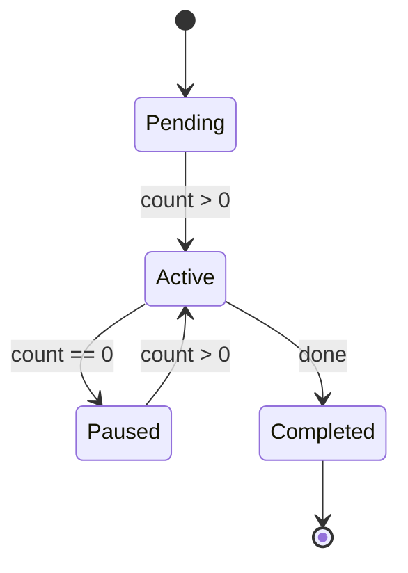

# State Diagram Template

## When to Use
State machines, status transitions, lifecycle flows, workflow automation

## Basic Template

## With Multiple States

## With Guards

## Best Practices
- Use `[*]` for start/end states
- Transition format: `StateA --> StateB: Trigger`
- Guards in square brackets: `StateA --> StateB: Event[condition]`