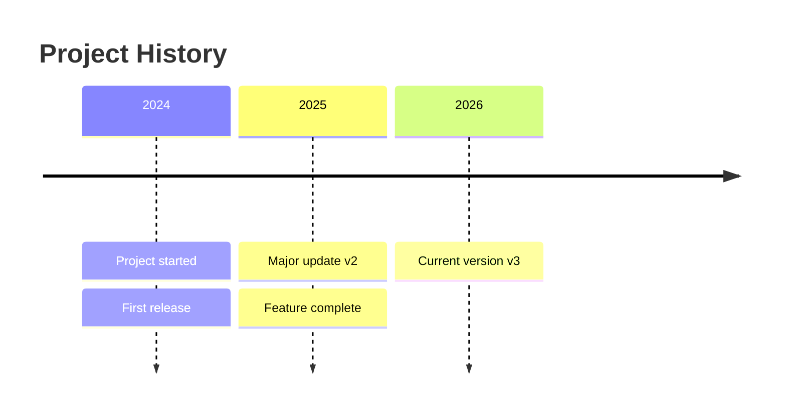
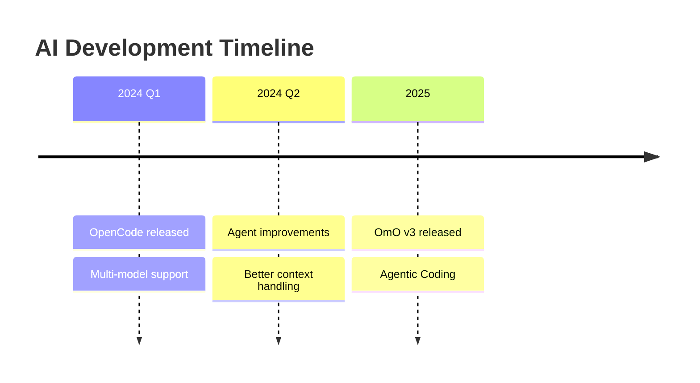

# Timeline Template

## When to Use
Historical events, chronological progression, history of changes

## Basic Template

## With Detailed Events

## Best Practices
- Use year, quarter, or date format
- Each event: `: Event description`
- Can have multiple events per time period