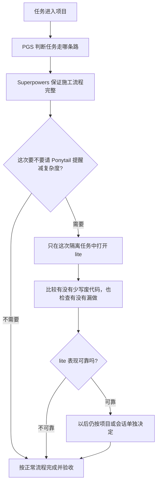

# SPEC-0004: Public Positioning And Ponytail Integration

## 先看懂全局

这次升级不是单纯“改一篇 README”，而是把三件互相影响的事一次理顺：

1. Ponytail 装好了以后，到底应该开还是关。
2. PGS 应该怎样向使用者推荐 Superpowers 和 Ponytail。
3. GitHub 首页怎样让第一次来的初学者也能马上看懂 PGS 有什么用。

可以把一个 AI 项目想成正在装修的房子：

| 角色 | 像什么 | 负责什么 |
| --- | --- | --- |
| PGS | 图书管理员、交通调度员和验收台 | 管文件放哪、任务走哪条路、结果有没有留下证据。 |
| Superpowers | 施工流程表 | 管先讨论、再计划、再测试、再施工、最后验收。 |
| Ponytail | 成本和复杂度顾问 | 提醒施工队少绕路、少加没用的材料和结构。 |
| Git | 施工录像和历史账本 | 记录谁在什么时候改了什么。 |

成本顾问很有价值，但不能让他为了省钱取消消防通道和验收。因此这次不会把 Ponytail
全局改成 `lite` 或 `full`。全局继续保持 `off`，需要时在隔离任务里单独打开，先比较
结果，再决定某个项目或某次会话是否使用。



公开介绍也采用同一原则：先告诉读者“它解决什么痛点”，再讲里面有哪些零件。英文
README 是唯一原文，中文、日文、西班牙文、法文和德文是忠实翻译。每个版本顶部都有
语言切换，任何人不需要先懂命令行就能开始阅读。

整个升级按下面顺序完成：

```text
写清 Ponytail 与 Superpowers 的边界
-> 写推荐工具文档
-> 把英文 README 迭代三轮
-> 生成并核对五种翻译
-> 更新 npm 包介绍和公开资产
-> 跑全部检查
-> 推送 GitHub 并等待 CI
-> 发布 npm 并做真实安装测试
-> 同步下游项目并逐个验证
-> 创建 GitHub Release
```

后面的章节是这张“通俗地图”的完整施工要求。它们写得更精确，是为了让实施时不会
因为一句话有两种理解而走偏。

## Problem

Project Governance System now includes two published package surfaces,
ProjectLens-style inspection, agent-asset management, documentation governance,
agents routing, and external workflow integration. Its public introduction has
not caught up with that system. The current root README is accurate but reads
like an internal architecture inventory: it explains many pieces before giving
a new reader one memorable answer to "why should I care?"

The repository also needs a durable boundary for Ponytail. Ponytail 4.7.0 is
installed as an external plugin for Codex and Claude Code, while the user's
global Ponytail mode is `off`. Turning `lite` or `full` on globally without an
experiment would make a persistent minimization prompt influence every project
and every Superpowers workflow. That could reduce unnecessary code, but it could
also pressure an agent to shorten tests, explanations, evidence, or requested
scope.

Beginner version: PGS is the project's librarian and traffic desk. Superpowers
is the construction checklist. Ponytail is the cost and complexity adviser.
The adviser can help the team use fewer materials, but it must not cancel the
inspection, fire exits, or the part of the building the owner explicitly asked
for.

The public introduction must make this full picture understandable to a reader
with no assumed knowledge of CLI tools, JSON, hooks, or AI-agent architecture.
It must also provide first-class English, Simplified Chinese, Japanese,
Spanish, French, and German reading paths without creating six competing
sources of product truth.

## Goals

1. Define an evidence-based Ponytail operating policy that cooperates with PGS
   and Superpowers.
2. Add a clear recommendation surface for Superpowers and Ponytail.
3. Rewrite the GitHub introduction using the Pyramid Principle and
   beginner-friendly explanations.
4. Publish five maintained translations from one canonical English source.
5. Align the npm-facing `@pieai/pro-gov` README with the new public position.
6. Validate, publish, and synchronize the known downstream projects directly.

## Decisions

### 1. Keep The Global Ponytail Default Off

PGS will not change `~/.config/ponytail/config.json` and will not tell users to
enable `lite`, `full`, or `ultra` globally by default.

The installed Ponytail implementation injects most of the shared minimalism
rules in both `lite` and `full`; only the intensity row and matching example are
filtered by mode. Therefore `lite` must not be described as equivalent to
"almost off." It remains a persistent influence on the same AI that runs
Superpowers.

The recommended order is:

```text
global off
-> explicit one-session or one-task trial
-> compare evidence
-> keep off or opt into a project-local/session mode deliberately
```

PGS documents the policy but does not own a user's global Ponytail setting.

### 2. Test Lite Before Full, In Isolation

Use the same bounded fixture or low-risk task in separate sessions/worktrees:

| Trial | Mode | Purpose |
| --- | --- | --- |
| Baseline | `off` | Record normal PGS + Superpowers behavior. |
| First comparison | `lite` | Measure whether complexity falls without losing requested scope or workflow gates. |
| Optional stress test | `full` | Detect whether stronger minimalism overrides planning, TDD, verification, documentation, or acceptance criteria. |

Every trial must end by returning Ponytail to `off`. `ultra` is outside the
recommended governed workflow and is not part of the first compatibility test.

Compare:

- requirement completeness;
- Superpowers workflow compliance;
- tests, security, accessibility, and error handling retained;
- files, dependencies, and lines changed;
- clarity of explanations and durable evidence;
- token/time data only when the host exposes trustworthy measurements.

No global mode change is accepted solely because one output is shorter.

### 3. Give Each System One Job

The precedence and responsibility model is:

1. User instructions and project safety requirements.
2. PGS routing, governance boundaries, and required evidence.
3. Superpowers workflow gates such as brainstorming, plans, TDD, debugging, and
   verification.
4. Ponytail advice about reducing optional scope, dependencies, files, and
   abstractions.

Ponytail may reduce what is unnecessary or how a requirement is implemented.
It may not remove an explicit requirement or reduce how correctness is proven.

Add `integrations/ponytail.md` as the canonical boundary. Keep Ponytail external
and do not vendor its skill or hook bodies. Update `integrations/superpowers.md`
to explain the companion relationship without making either plugin part of the
PGS package runtime.

### 4. Add One Recommended Tooling Reference

Create `docs/reference/adoption/recommended-agent-tooling.md` as the human
recommendation surface. It must distinguish:

- required PGS packages;
- recommended engineering workflow tooling such as Superpowers;
- optional complexity advisers such as Ponytail;
- project-type differences, especially that doc-only projects do not need the
  full engineering workflow by default.

Superpowers is recommended for engineering/runtime work. Ponytail is recommended
as an installed, opt-in adviser with global mode `off`, not as a mandatory
always-on policy.

Link this reference from the adoption playbook, root README, and relevant public
positioning material.

### 5. Rewrite The Root README As A Pyramid

The canonical English `README.md` will lead with the answer, then support it:

1. **Answer:** PGS keeps AI-assisted projects understandable and governable over
   time.
2. **Pain:** AI can create plans, specs, rules, and evidence faster than humans
   can organize them.
3. **Memorable model:** PGS is the librarian, traffic desk, and inspection
   machine for durable AI project work.
4. **Proof:** explain doc-gov, pro-gov, ProjectLens, profiles, agent assets, and
   external workflow boundaries.
5. **Action:** give a short evaluation path before the detailed reference.

The README must not assume that a GitHub visitor is an experienced programmer.
Technical terms may appear only after a plain-language explanation. Commands
remain available for readers who are ready to act, but the opening must explain
the value before presenting installation syntax.

Confident language and mild rhetorical exaggeration are allowed. False claims
are not. The README must not claim automatic migration, guaranteed token
savings, replacement of Git/Superpowers, or publication of private/third-party
skills.

### 6. Require Three Explicit README Passes

The implementation record must show three review passes:

1. **Pyramid pass:** answer first, pain before architecture, strongest benefits
   before repository inventory.
2. **Beginner pass:** explain every core concept with plain language, analogy,
   and at least one concrete scenario; remove unexplained jargon and walls of
   text.
3. **Truth and conversion pass:** cross-check claims against code/config,
   sharpen the highlights, verify links and commands, and ensure a reader can
   choose the next action.

The third pass is refinement, not permission to add unsupported marketing
claims.

### 7. Use English As The Translation Source Of Truth

Use a language switcher at the top of every public introduction:

```text
English | 简体中文 | 日本語 | Español | Français | Deutsch
```

Keep these files at the repository root for the most direct GitHub navigation:

- `README.md` (canonical English)
- `README.zh-CN.md`
- `README.ja-JP.md`
- `README.es.md`
- `README.fr.md`
- `README.de.md`

Each translation must state that English is canonical when wording drifts. The
translations preserve meaning, examples, headings, links, code, and safety
boundaries; they are not independent rewrites. A parity check must compare the
heading/link/code-block structure across all six files.

### 8. Keep GitHub And npm Introductions Aligned

Update `packages/pro-gov/README.md` with the same short answer, pain, boundary,
and beginner analogy, followed by package-specific install and command details.
It remains shorter than the root README and links to the canonical GitHub
introduction for the full story.

Implementation uncovered and fixed a real `doc-gov doctor` bug: linked Git
worktrees store `.git` as a pointer file, so the old hard-coded `.git/hooks`
lookup falsely reported that Lefthook was missing. Because the `doc-gov`
package body now changes, both `@pieai/doc-gov` and `@pieai/pro-gov` ship as
`0.3.5`. The pro-gov tarball resolves its validator dependency to
`@pieai/doc-gov ^0.3.5`. Private and third-party `agent-assets/` bodies remain
excluded, as do operating-system metadata files such as `.DS_Store`,
`Thumbs.db`, and AppleDouble `._*` files.

### 9. Publish Only After Public Verification

The release sequence is:

1. run local typecheck, tests, build, doc-gov checks, pro-gov doctor, translation
   parity, link checks, and both package dry-run packs;
2. commit and push a clean `main`;
3. wait for GitHub Actions success;
4. configure npm Trusted Publisher for the GitHub Actions `npm-publish.yml`
   workflow when the package settings do not already trust it;
5. publish `@pieai/doc-gov@0.3.5` and `@pieai/pro-gov@0.3.5` through the
   manual GitHub Actions publish workflow;
6. verify the public npm registry and install both packages in a temporary
   project;
7. create and verify GitHub release `v0.3.5`;
8. confirm `main` is clean and synchronized.

### 10. Synchronize Downstream Projects Directly

The implementation session synchronizes downstream projects directly instead of
producing a handoff prompt. The rule is conservative: update the installed
`@pieai/doc-gov` and `@pieai/pro-gov` versions, run project-appropriate checks,
and preserve project-local truth. Do not blindly copy the central repository
into downstream projects.

On 2026-06-21, ten existing downstream projects were updated to `0.3.5` and
pushed on their `main` branches: Anvil, Collapse, Non-Heroes,
PieAIStudio-Site, PieHQ, Sea, Show, SupaLuv, YaZu, and TuringPact.
`/Users/yuanfei/PieAI/ProjectLens` did not exist locally, so it was removed from
the active downstream registry instead of being synchronized as a separate
repository.

## Planned File Changes

| Surface | Planned change |
| --- | --- |
| `README.md` | Canonical English Pyramid Principle rewrite. |
| `README.<locale>.md` | Five full translations with language switcher. |
| `integrations/ponytail.md` | New external-plugin boundary and mode policy. |
| `integrations/superpowers.md` | Clarify workflow priority and Ponytail cooperation. |
| `docs/reference/adoption/recommended-agent-tooling.md` | New recommendation reference. |
| `docs/reference/adoption/adoption-playbook.md` | Link recommended tooling and preserve profile distinctions. |
| `docs/reference/adoption/site-publication-brief.md` | Align public claims and highlights. |
| `packages/pro-gov/README.md` | Beginner-friendly npm package introduction. |
| `packages/pro-gov/assets/**` | Generated by the existing build, not hand-edited. |
| `packages/doc-gov/src/commands/doctor.ts` | Resolve hooks through Git so linked worktrees are recognized. |
| `packages/doc-gov/src/commands/doctor.test.ts` | Reproduce the linked-worktree hook layout with a real Git repository. |

## Non Goals

- Do not change the user's global Ponytail configuration.
- Do not enable Ponytail automatically in downstream projects.
- Do not vendor Ponytail or Superpowers plugin bodies.
- Do not make Ponytail a dependency of `@pieai/pro-gov`.
- Do not promise a percentage reduction in code, tokens, time, or cost.
- Do not publish private or third-party agent skill bodies.
- Do not redesign doc-gov lifecycle/schema or add another project profile.

## Requirements

1. Keep global Ponytail mode `off` throughout implementation and release.
2. Document isolated `off`/`lite`/optional-`full` comparison instead of changing
   global mode.
3. State that Ponytail cannot override explicit requirements, safety,
   Superpowers gates, tests, verification, or PGS evidence.
4. Add Ponytail and Superpowers to one canonical recommended-tooling reference.
5. Rewrite the English README using answer-first Pyramid Principle structure.
6. Make the README understandable without assumed CLI, hook, JSON, or agent
   architecture knowledge.
7. Include concrete examples and the librarian/traffic-desk/inspection-machine
   analogy without allowing the analogy to replace accurate boundaries.
8. Complete and record three distinct README review passes.
9. Add Simplified Chinese, Japanese, Spanish, French, and German translations.
10. Put the same six-language switcher at the top of every README variant.
11. Treat English as canonical and verify translation structure parity.
12. Update the npm-facing pro-gov README and copied integration/reference assets.
13. Keep private and third-party assets out of the public tarball.
14. Run the complete repository verification and require successful GitHub CI.
15. Verify the public npm version and a clean temporary installation before
    creating the GitHub release.
16. Synchronize the downstream projects listed in the adoption registry from
    this session, preserving project-local truth and verifying each project.

## Acceptance

- A new reader can answer what PGS is, what pain it solves, and how it differs
  from Git, AGENTS.md, Superpowers, and Ponytail after reading the opening.
- The root README leads with user value instead of repository internals.
- All six README files contain working mutual language links and equivalent
  major sections, examples, commands, and boundaries.
- `integrations/ponytail.md` identifies global `off` as the safe default and
  describes isolated testing of `lite` before optional `full`.
- The recommendation reference includes both Superpowers and Ponytail with
  different, accurate recommendation strength.
- The pro-gov npm tarball contains the new public integration/reference assets,
  resolves `@pieai/doc-gov` to the published dependency range, and excludes
  private/third-party assets.
- Local checks and GitHub Actions pass from the final commit.
- npm publicly resolves both packages at `0.3.5`, and a temporary project can
  run both CLIs.
- GitHub publishes `v0.3.5` only after npm verification.
- The final report lists each downstream project synchronized and its
  verification result.
