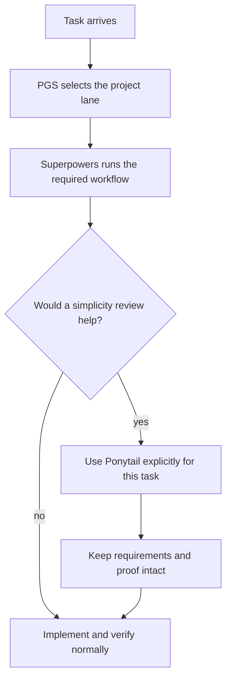

# Ponytail Integration

Ponytail is an external plugin that asks an AI to prefer the smallest solution
that still works. Project Governance System does not vendor, rewrite, or require
the Ponytail plugin.

## The Beginner Version

Think of an AI project as a building site:

- PGS is the traffic desk and inspection station.
- Superpowers is the construction process.
- Ponytail is the cost and complexity adviser.

The adviser can stop the team from buying unnecessary materials. The adviser
cannot cancel the fire exit, the safety inspection, or a room the owner
explicitly requested.

## Safe Default

Keep the global Ponytail mode `off`.

`off` does not mean Ponytail is useless. It means Ponytail is available when a
task needs a simplicity review without silently influencing every project and
every answer.

Do not describe `lite` as "almost off." In Ponytail 4.7.0, `lite` still injects
the shared minimalism rules into the active AI context. Its mode-specific line
is gentler than `full`, but the same AI still sees rules about fewer files,
fewer abstractions, shorter diffs, and avoiding speculative work.

## Mode Policy

| Mode | Governed use |
| --- | --- |
| `off` | Recommended global default. Ponytail does not inject its active ruleset. |
| `lite` | First mode to test in one isolated task or session. Complete the requested work, while surfacing a simpler option. |
| `full` | Optional stress test after `lite`. Use only in an isolated task to see whether stronger minimalism harms scope or proof. |
| `ultra` | Not part of the recommended PGS workflow. It is too aggressive for a default governed engineering lane. |

Return to `off` after every comparison.

## Comparison Protocol

Use the same bounded, low-risk task in separate sessions or worktrees:

```text
baseline with off
-> repeat with lite
-> compare scope, proof, complexity, and clarity
-> optionally repeat with full
-> return global mode to off
```

Compare:

- whether every requested requirement was delivered;
- whether Superpowers brainstorming, planning, TDD, debugging, and verification
  gates were preserved;
- whether tests, security, accessibility, validation, and data-loss prevention
  remained intact;
- files, dependencies, abstractions, and lines changed;
- whether the explanation and durable evidence stayed understandable;
- token and time measurements only when the AI host exposes trustworthy data.

A shorter answer or smaller diff is not automatically a better result.

## Priority And Boundary

Use this priority order:

1. User instructions and project safety requirements.
2. PGS routing, governance boundaries, and required evidence.
3. Superpowers workflow gates.
4. Ponytail complexity and cost advice.

Ponytail may:

- question speculative scope;
- prefer the standard library or an already-installed dependency;
- suggest fewer files, dependencies, and abstractions;
- identify code or structure that can be removed safely.

Ponytail may not:

- remove an explicit requirement;
- bypass PGS routing or document placement;
- skip required brainstorming, plans, TDD, debugging, or verification;
- weaken security, accessibility, trust-boundary validation, error handling, or
  data-loss protection;
- replace proof with "the code is shorter";
- silently change the user's global Ponytail configuration.

## Recommended Workflow



For normal engineering, Ponytail is a scoped adviser, not a second workflow
engine and not a replacement for Superpowers.

## ProjectLens Audit Use

When ProjectLens and Ponytail are used together for a target-project audit,
ProjectLens owns the audit package contract. Ponytail acts as an independent
senior engineering reviewer whose simplicity, YAGNI, dependency, abstraction,
and rewrite judgment can challenge ProjectLens recommendations.

For this combined workflow, "read-only project audit" means the target
repository must not be modified. It does not mean "do not write the PGS audit
package." The audit package is the required owner-facing evidence record.

Use this order:

1. The main agent establishes target path, goal, current phase, target commit or
   working state, then creates the package with
   `pro-gov lens audit init --target <path> --out audits/<target>/<date>`.
2. ProjectLens gathers local evidence and writes its own raw artifacts under
   `raw/project-lens/`.
3. Ponytail runs independently and writes its own raw artifacts under
   `raw/ponytail/`. For initial whole-project audits, preserve at least
   `ponytail-audit`, `ponytail-debt`, and `ponytail-gain` outputs when the
   plugin can produce them.
4. The target command log records Project Lens and Ponytail method sources.
5. The main agent writes `synthesis/decision-index.md` and
   `synthesis/handoff-for-implementation-ai.md`, then runs
   `pro-gov lens audit check --dir audits/<target>/<date>`.

Use subagents for the ProjectLens/Ponytail raw passes when the AI host exposes
them and the user has authorized subagent or parallel agent work. If host rules
block subagents, preserve the same raw-output separation with serial passes and
record the fallback in the audit package. Do not claim that subagents were used
when they were not. The manifest must include `Subagent trace:` with each pass
role, execution mode, final status, and raw artifact path; if durable subagent
IDs are unavailable, record that limitation.

Do not blur a fresh audit with a reuse verification. For a fresh ProjectLens plus
Ponytail audit, run `pro-gov lens audit check --dir <audit-dir> --mode fresh`.
If an existing package is reused because the target commit and package check are
still valid, label the result as reuse and run `--mode reuse`.

Do not blend Ponytail findings into ProjectLens files. Do not suppress Ponytail
to make ProjectLens look correct. Preserve material disagreements in the raw
artifacts and let the synthesis state which judgment won and why. The shared
boundary is evidence, user intent, project safety, explicit product-line
direction, and PGS's technology-governance protocol. If a stack direction
exists, Ponytail may challenge migration scope, timing, and complexity, while
ProjectLens records the direction as the product group's stated intent and PGS
classifies the execution posture.

Use `ponytail-review` later for implementation diffs or PR-style changes. For
initial read-only project audits, prefer the whole-repo Ponytail modes above so
the audit starts from system shape instead of line-level patch review.
