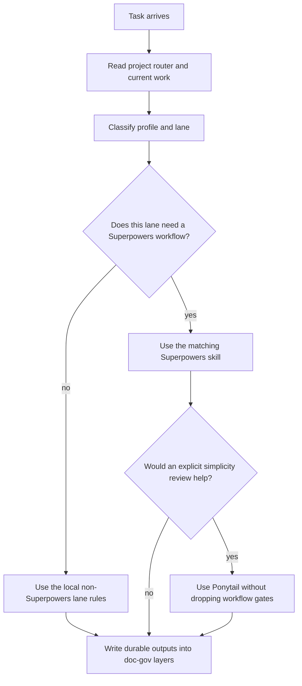

# Superpowers Integration

Superpowers is an external plugin/system. This repository does not vendor or rewrite it.

## The Beginner Version

Think of an AI project as a building site:

- PGS is the traffic desk and inspection station.
- Superpowers is the construction process.
- Ponytail is an optional cost and complexity adviser.

PGS chooses the lane. Superpowers makes sure the work follows the right
engineering process. Ponytail may suggest a leaner implementation, but it
cannot cancel the process or the final inspection.

## Boundary

Superpowers owns engineering workflows such as:

- brainstorming
- writing plans
- TDD
- debugging
- verification before completion
- worktree usage

Project Governance System owns:

- documentation lifecycle
- agents routing
- current work index conventions
- the governed location and boundary for externally sourced AI evidence rules

Ponytail, when explicitly enabled for a task, may advise on:

- speculative scope;
- unnecessary dependencies;
- avoidable files and abstractions;
- simpler implementation choices.

## Rule

Use Superpowers inside the selected project lane. Do not let Superpowers create a separate durable document tree unless the project explicitly adopts one.

Durable outputs should map back to the project's doc-gov layers:

- specs -> `docs/specs/**`
- plans -> `docs/plans/**`
- durable references -> `docs/reference/**`

## Execution Order

Agents routing classifies first. Superpowers executes inside the selected lane.
Optional Ponytail advice comes after those responsibilities are known. It may
make the implementation leaner, but it must not remove explicit requirements or
reduce how correctness is proven.

If Superpowers suggests a default location such as `docs/superpowers/**`, project instructions may override that location. The durable project record should still land in the governed doc-gov layer unless the project has explicitly adopted a separate Superpowers document tree.

Host-specific files such as `CLAUDE.md` may include Superpowers skill routing
text. That text is an adapter. It must not replace the project `AGENTS.md`
router or run before the Project Governance System routing block.

For Ponytail mode policy and the isolated comparison protocol, read
`integrations/ponytail.md`.
