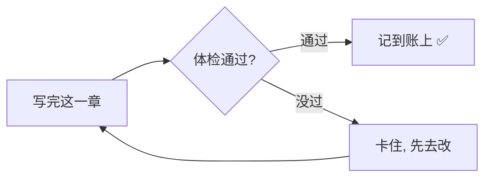

# 教学文档写作技能

把复杂系统变成目标读者能读懂、愿意读、读完有收获的教学文档。

## 核心信念

- **如果读者看不懂，是作者的问题，不是读者的问题。**
- 所有概念都能用比喻辅助理解。如果你觉得找不到比喻，说明你还没理解透。
- 不要用"简单来说"来掩盖说不清楚。真正清晰的解释不需要这个前缀。
- 图比文字有效，例子比定义有效，对话比步骤有效。

## 第零步：判断难度层级

在开始写之前，先明确文档面向的读者层级。

| 层级 | 目标读者 | 前置知识假设 | 核心写法 |
| --- | --- | --- | --- |
| 🟢 初级 | 完全不懂技术的人 | 不知道 CLI、JSON、hash 是什么 | 100% 故事驱动，比喻先行，隐藏所有技术细节 |
| 🟡 中级 | 读过初级文档，会基本操作 | 知道系统角色和核心流程 | 故事 + 真实命令/输出，打开更多底层细节 |
| 🔴 高级 | 有实战经验，遇到过问题 | 能独立跑流程，需要理解边界和原理 | 深度原理 + 边界条件 + 故障排查 + 对比分析 |

**如何判断**：
- 用户明确说了（"给新手写""写进阶指南""高级用法"）→ 直接用
- 文档标题/位置暗示了（`beginner-guide` vs `advanced` vs `reference`）→ 推断
- 不确定 → 问用户

**层级不同，但方法论相通。** 以下所有步骤在三个层级都适用，只是具体写法不同。

## 写作流程

### 第一步：深度研究目标系统

在写任何一个字之前，先彻底搞清楚系统到底怎么工作。

1. **读源代码和配置**——不是读文档，是读实际的代码、配置文件、命令行输出
2. **找到真实的数据结构**——检查真实的目录结构、JSON 文件、配置项
3. **跑一遍流程**——如果可能的话，实际执行一次系统的核心流程，看看每一步到底产生了什么
4. **列出所有核心概念**——把系统里的每个关键概念列出来

然后根据层级决定哪些概念需要展开、哪些可以简化、哪些可以先跳过。

| 层级 | 研究重点 |
| --- | --- |
| 🟢 初级 | 核心流程 + 关键角色。省略所有实现细节。 |
| 🟡 中级 | 完整流程 + 状态转换 + 常见场景。展示真实命令和输出。 |
| 🔴 高级 | 边界条件 + 失败模式 + 底层原理 + 设计决策的 why。 |

### 第二步：设计故事线

为整套文档设计一个**贯穿的虚拟人物和场景**。

设计要素：
- **虚拟人物**：给他/她一个名字、一个具体的目标、一个清晰的动机
- **人设约束**：人物的技术水平应该匹配目标读者
- **目标场景**：一个具体的、可以从头走到尾的任务
- **进阶挑战**：如果是中级/高级文档，给人物设计越来越复杂的情境

| 层级 | 人物设定 | 场景复杂度 |
| --- | --- | --- |
| 🟢 初级 | 完全不懂技术，第一次用系统 | 一个简单任务从头到尾 |
| 🟡 中级 | 会基本操作，遇到了新情况 | 多个场景、有状态变化、有分支 |
| 🔴 高级 | 有经验但遇到复杂问题 | 故障排查、边界条件、多步连锁 |

**故事线是骨架，不是装饰。** 所有概念都必须在故事里自然地出场。

### 第三步：规划文档结构

按照**读者学习的自然顺序**来组织文档，而不是按照系统的技术架构。

**通用原则**（所有层级）：
- 先讲"为什么要学这个"，再讲"怎么做"
- 每篇有明确的学习目标和预计阅读时间
- 篇与篇之间有自然的过渡
- 全套文档有一个 index 做导航

**篇数不固定**——根据内容复杂度决定，不要把太多东西塞进一篇，也不要把一个小概念拆成一整篇。一篇文档的最佳长度是 8-15 分钟阅读。

### 第四步：逐篇撰写

对每一篇文档，遵循以下写法：

#### 开头
- 用一句话说清"读完这篇你会知道什么"
- 🟢 初级：不要用技术术语开场
- 🟡 中级：可以引用系统术语，但附上回顾链接
- 🔴 高级：可以直接用术语，但要精确定义

#### 比喻和类比

比喻在所有层级都有用，但使用方式不同：

| 层级 | 比喻策略 |
| --- | --- |
| 🟢 初级 | 每个新概念必须先给比喻，再给解释。用日常生活场景（装修、做菜、体检）。 |
| 🟡 中级 | 复杂概念用比喻辅助，简单概念直接解释。可以用专业但通用的比喻（版本控制、质检流水线）。 |
| 🔴 高级 | 在解释设计决策时用比喻说明 why。可以用技术领域的类比（CAP 定理、乐观锁 vs 悲观锁）。 |

比喻的通用要求：
- **先给比喻，再给解释**，不要反过来
- 比喻不能过度延伸——用到它能解释的那个点就停
- 一个特别重要的概念，给两个不同角度的比喻

#### 可视化

**每个流程和概念关系都画 mermaid 图**，所有层级通用：

- 流程 → `graph TD/LR`
- 时间顺序 → `sequenceDiagram`
- 状态变化 → `stateDiagram-v2`
- 概念关系 → `mindmap`
- 对比 → 并排的 `subgraph`
- 分类决策 → 带 `{}` 判断节点的 `graph`

层级差异：

| 层级 | 图表策略 |
| --- | --- |
| 🟢 初级 | 图里只用人话标签，不放术语。颜色丰富，一眼就懂。 |
| 🟡 中级 | 图里用系统术语 + 人话注释。展示真实状态和分支。 |
| 🔴 高级 | 图里展示底层数据流、哈希依赖关系、失败路径。 |

#### 操作示例

| 层级 | 示例风格 |
| --- | --- |
| 🟢 初级 | 用"故事人物说了什么话"来展示，不列命令。表格格式：步骤 \| 你可以说的话。 |
| 🟡 中级 | 先给自然语言对话，然后展示 AI 实际执行的命令和输出，两者对照。 |
| 🔴 高级 | 直接给命令 + 输出 + 解读。展示异常输出和错误信息的解读方式。 |

#### 结尾
- "快速回顾"FAQ 表格：你可能会问 | 答案
- 🟡🔴 中高级：补充"自测题"和参考答案
- 🟡🔴 中高级：术语精确定义表（不只是人话对照，而是精确的功能边界）
- "下一篇"的自然过渡

#### 一个微型示例（初级层级长这样）

光说方法不够，看一眼差别最快。同一个事实，技术写法 vs 初级写法：

> ❌ 技术写法：「gate 校验通过后，hook 会触发 memory update，将 accepted-commit 写入记忆库。」
>
> ✅ 初级写法：「这一步你可以想成**体检合格才发证**。系统先给这一章做一次"体检"——查字数够不够、跟大纲对不对得上。只有全部过了，它才肯把这一章"记到账上"；没过就卡住，逼你先改。」

配一张一眼能懂的图（标签全用人话，不出现术语）：

操作示例用"人物说的话"，不列命令：

| 步骤 | 小白可以对 AI 说的话 |
| --- | --- |
| 让它体检 | "帮我看看这章能不能过" |
| 没过要改 | "它说哪里不行？带我一起改" |

这就是初级写法的签名：**比喻先行 → 配图 → 用对话代替命令**。中高级在此基础上逐步打开真实命令和底层原理。

### 第五步：深度迭代

写完初稿后，至少做一轮深度迭代：

1. **补图**——检查每个流程和概念是否都有对应的 mermaid 图
2. **补比喻**——检查每个抽象概念是否都有合适层级的比喻
3. **补示例**——检查每个操作步骤是否都有对应层级的操作示例
4. **检查术语**——搜索文档中是否有未解释的术语，根据层级决定是替换、加注还是直接用
5. **增加对比图**——在有 before/after、对比、分支选择的地方加可视化
6. **检查连贯性**——故事人物的经历是否跨篇连贯
7. **检查深度递进**——如果是系列文档，后面的篇章是否在前面的基础上递进，而不是重复

### 第六步：交叉验证

这一步至关重要，单独列为一个技能（见 `doc-cross-validator` 技能）。

写完后必须对照真实系统验证文档内容，确保没有自己想当然地编造流程。

## 红线（这些是 AI 写教学文档时反复栽的坑，记住"为什么"就不会犯）

**所有层级**：
- 别用"简单来说"开头——它八成是"我没讲清楚"的遮羞布，真清楚的解释不需要这个前缀
- 别让一整段纯文字不带任何视觉元素（图/表/引用块）——读者的眼睛需要落脚点，文字墙会劝退人
- 别写完不做交叉验证——读着顺但流程是错的，比"丑但对"更危险（见 `doc-cross-validator`）
- 别在没有比喻或例子的情况下抛出复杂概念——抽象概念没有抓手，读者会假装看懂然后悄悄放弃

**初级额外**：
- 别假设读者知道 CLI、JSON、hash、config、commit 是什么——只要假设了，从那一句起读者就掉队了
- 别在正文里直接贴命令行——初级读者看到命令会本能紧张，把操作藏进"对人说的话"里

**中级额外**：
- 别只给命令不解释为什么这样做——会用但不懂原理，遇到变化就懵
- 别跳过"从初级概念到这个新概念"的桥接——读者是顺着上一篇爬上来的，断一节台阶就摔下去

**高级额外**：
- 别只说"怎么做"不说"为什么这样设计"——高级读者要的正是 why，怎么做他们能自己查
- 别把边界条件和失败模式当"不重要"省掉——真正咬人的恰恰是这些，省了等于没写

## 质量标准

下面这张表是**自检基准，不是凑数指标**。判断每一项只有一个标准：**读者读到这里，缺了这个东西会不会卡住、会不会误解？** 会，就补；不会，硬凑反而是噪音。举个例子——一篇全是线性叙述、没有任何分叉的短文，硬塞三张图只会稀释重点，这时一张关键流程图就够了。别为达标而达标，AI 足够聪明，自己判断。

| 维度 | 🟢 初级 | 🟡 中级 | 🔴 高级 |
| --- | --- | --- | --- |
| 比喻 | 每个核心概念配一个 | 复杂概念配 | 解释设计决策时配 |
| 图表 | 每个流程/概念关系都该配图；多步流程却一张图都没有，是信号 | 关键流程与状态配图 | 数据流、失败路径、依赖关系配图 |
| 操作示例 | 自然语言对话表格 | 对话 + 命令对照 | 命令 + 输出 + 解读 |
| FAQ | 结尾配"快速回顾" | 结尾配 | 结尾配 + 自测题 |
| 术语处理 | 全部用人话替代 | 系统术语 + 人话注释 | 精确定义 + 功能边界 |
| 连贯性 | 虚拟人物贯穿 | 虚拟人物贯穿 | 场景贯穿 |
| 阅读时间 | 目标 8-12 分钟，超长就拆篇 | 目标 10-15 分钟 | 目标 10-20 分钟 |
