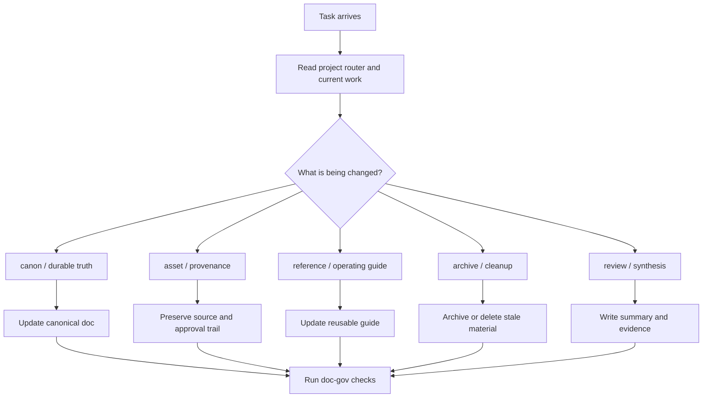

# Doc-Only Task Routing

Shared routing algorithm for non-runtime projects such as AI media, IP development, research, and asset governance workspaces.

This route does not use Superpowers TDD or Directed Development by default.

## Core Flow

## Rules

- Do not ask whether the task needs TDD unless the project has actual runtime code.
- Do not trigger Directed Development unless the project explicitly opts in.
- Prefer SSOT, provenance, and approval clarity over engineering ceremonies.
- Use AI-in-the-Loop for evidence: inspect source, change one thing, verify the target document or asset path.

## Typical Lanes

- canon truth
- asset intake and promotion
- production/reference guide
- archive and cleanup
- research synthesis

The local project decides exact lane names.
