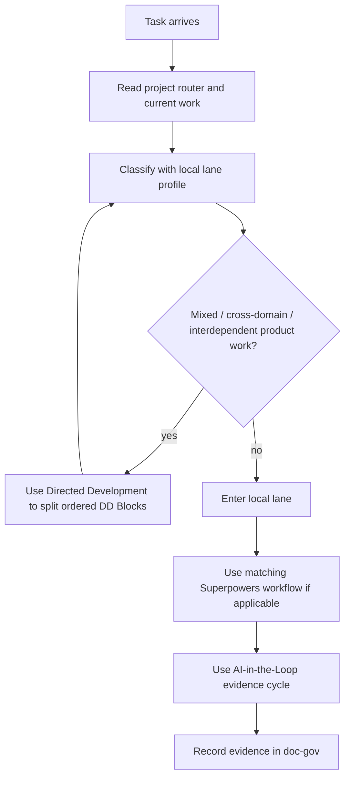

# Engineering Task Routing

Shared routing algorithm for app, game, runtime, and code-heavy projects.

This file decides **how to choose a workflow**, not what the project is currently building. Current work belongs in the project's `docs/reference/execution/current-work.md` or equivalent.

## Core Flow

## Keep It Small

Use this router only to pick depth and workflow. Do not use it as a project roadmap.

## DD Trigger

Use Directed Development only when all are true:

- the task is product work
- it crosses local lanes or shared contracts
- sequencing risk makes a flat plan unsafe

Do not trigger DD for broad mechanical edits, renames, formatting, or ordinary docs migration.

## Project-Local Lane Profile

Every engineering project must define its own lane profile in `AGENTS.md` or `governance/best-practice-for-this-project.md`.

Typical lanes:

- visual / UX / game-feel
- content / config / canon
- behavior-critical code
- pure refactor

But the shared router must not define project-specific lanes.
